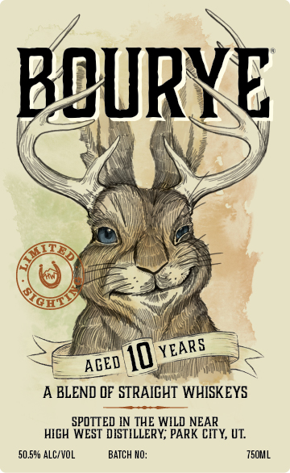
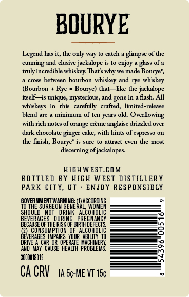

# TTB COLA Label Images - TTBID 26264001000478

**Brand Name:** HIGH WEST

**Fanciful Name:** BOURYE

**Issue Date:** 09/30/2026

**Origin Code:** 45

**Product Class/Type:** 120

**Source:** [TTB Public COLA Registry](https://ttbonline.gov/colasonline/viewColaDetails.do?action=publicFormDisplay&ttbid=26264001000478)

## Label Images

### Back Label

### Label 2

## Extracted Label Text

*Text extracted via OCR - may contain errors*

### Back Label

BQURVE
10
A BLEND OF STRAICHT WHISKEYS
SPOTTED IN THE WILD NEAR
HICH WEST DISTILLERY; PARK CIT Y, UT
50.590 AlC/VOL
BATCH HlO:
7501L
YEARS
AGED

### Label 2

BOURYE

Legend has it, the only way to catch a glimpse of the
cunning and elusive jackalope is to enjoy a glass of a
truly incredible whiskey. That's why we made Bourye*,
1 cross between bourbon whiskey and rye whiskey
Bourbon + Rye = Bourye) that—like the jackalope
itself—is unique, mysterious, and gone in a flash. All
whiskeys in this carefully crafted, limited-release
bblend are a minimum of ten years old. Overflowing:
with rich notes of orange créme anglaise drizzled over
dark chocolate ginger cake, with hints of espresso on
the finish, Bourye' is sure to attract even the most
discerning of jackalopes.

HIGH WEST.COM
BOTTLED BY HIGH WEST DISTILLERY
PARK CITY, UT - ENJOY RESPONSIBLY

OVERNMENT WARNE ACEoRDE
TO THE SURGEON GENERAL, WOMEN
SHOULD NOT DRINK ALCOHOLIC
BEVERAGES, DURING PREGNANCY
BECAUSE OF THE RISK OF BIRTH DEFECTS.
2) CONSUMPTION OF ALCOHOLIC

/ERAGES IMPAIRS YOUR ABILITY 1)
DRIVE AGAR OR OPERATE MACHINERY,
‘AUD MAY CAUSE HEALTH PROBLEMS.

soon013

CACRV ta se-me vt 15
