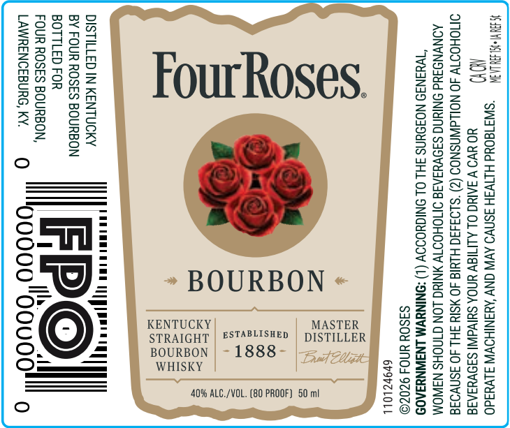

# TTB COLA Label Images - TTBID 26264001000520

**Brand Name:** FOUR ROSES

**Issue Date:** 09/22/2026

**Origin Code:** 22

**Product Class/Type:** 101

**Source:** [TTB Public COLA Registry](https://ttbonline.gov/colasonline/viewColaDetails.do?action=publicFormDisplay&ttbid=26264001000520)

## Label Images

### Front Label

## Extracted Label Text

*Text extracted via OCR - may contain errors*

**Detected Proof:** 80

### Front Label

LW -syrjaoud HIEIV3H 3SNWO AVN NY ‘AYANIHOWW alvuado

NOY) HO UVO V ARG OL ALIMIaW UNDA SUlvaINI SIOVUIAIS
OMOHOOTY 40 NOLLdWNSNOS (2) ‘$193430 HUIS JO ¥SIY SH 40 3snvo34
AONVNOSUd ONIUNG SIOVYIATS OTTOHODTY MNIUG_LON CTNCHS N3WOA
“WHINIO NOFOUNS 3H OL ONIGHOIOY (1) <ONINYVM LNBWNYSAOS

DISTILLED IN KENTUCKY
BY FOUR ROSES BOURBON
BOTTLED FOR

FOUR ROSES BOURBON,
LAWRENCEBURG, KY.

» BOURBON «

KENTUCKY
STRAIGHT

S3SOY UND 9Z0ZO
69PZLOLL

ESTABLISHED | DISTILLER

- 1888-

WHISKY

BOURBON

40% ALC./VOL. (80 PROOF) 50 ml
