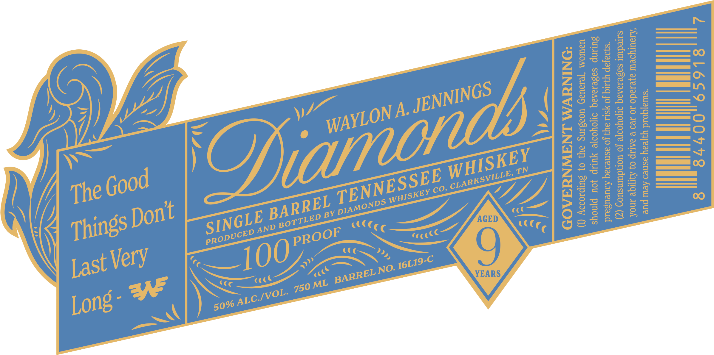

# TTB COLA Label Images - TTBID 26264001000593

**Brand Name:** WAYLON A. JENNINGS DIAMONDS

**Issue Date:** 09/23/2026

**Origin Code:** 43

**Product Class/Type:** 140

**Source:** [TTB Public COLA Registry](https://ttbonline.gov/colasonline/viewColaDetails.do?action=publicFormDisplay&ttbid=26264001000593)

## Label Images

### Front Label

### Label 2

## Extracted Label Text

*Text extracted via OCR - may contain errors*

*1 image(s) excluded: text did not meet readability threshold*

**Detected Age:** 9 Years

### Front Label

N
084l4
7
Ji
56
Li
3
2
6
1
8444
8
r
3
26
03
8
TN
8
3
1
8
3
1
1
8
HH
8
AGED
3
8
((((
8
Very
9
YEARS
3v
Ofiamonds
WHISKEY
Good
TENNESSEE
CLARKSVILLE,
The
Co,
WHISKEY
BARREL
DIAMONDS
Dont
BY
SINGLE
Things
BOTTLED
AND
PROOF
PRODUCED
100-
Last
16LI9-C
NO:
BARREL _
ML
750_
ALC.IVOL:
Long -
50%_
