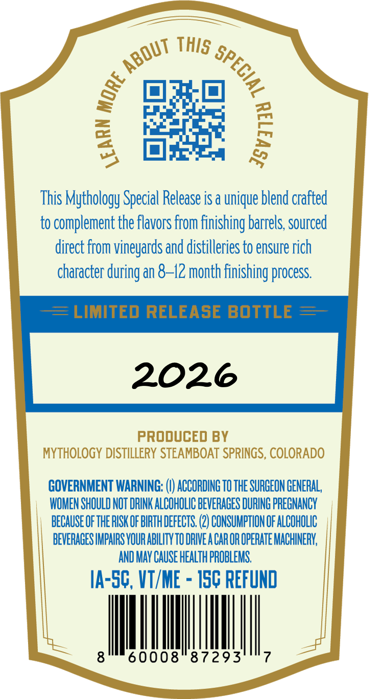
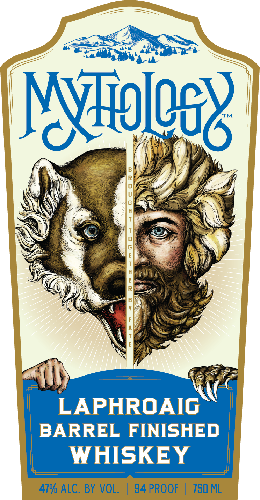

# TTB COLA Label Images - TTBID 26264001000688

**Brand Name:** MYTHOLOGY

**Fanciful Name:** LAPHROAIG

**Issue Date:** 09/23/2026

**Origin Code:** 13

**Product Class/Type:** 140

**Source:** [TTB Public COLA Registry](https://ttbonline.gov/colasonline/viewColaDetails.do?action=publicFormDisplay&ttbid=26264001000688)

## Label Images

### Back Label

### Front Label

## Extracted Label Text

*Text extracted via OCR - may contain errors*

**Detected Proof:** 94

### Back Label

This Mythology Special Release is a unique blend crafted
to complement the flavors from finishing barrels; sourced
direct from vineyards and distilleries to ensure rich
character during an &-12 month finishing process
LIMItEd RELEASE BOTTLE
2026
produCed BY
MYTHOLOGY DISTILLERY STEAMBOAT SPRINGS, COLORADO
GOVERNMENT WARNING:
ACCODING TO THE SURGEON GENERAL,
WOMEN SHOULD NOT DRINK ALCOHOLIC BEVERAGES DURING PREGNANCY
BECAUSE OFTHE RISK OF BIRTH DEFECTS, (2) CONSUMPTHON OF ALCOhOLIc
BEVERAGES IMPAIRS VOUR ABILITV TO DRIVE A CAR OR OPERATE MACHINERK;
AND MAY CAUSe HEALTH PROBLEMS,
IA-SG, VT/ME
I5G Refund
8'
60008
87293
ThIS
ABOUT
1
1
1
9

### Front Label

Niles
1
R
:
LAPHROAIG
BARREL FINISHED
WHISKEY
479 ALC. BY VOL.
94 PROOF
750 ML
