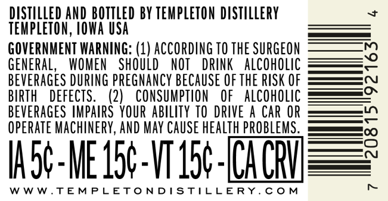
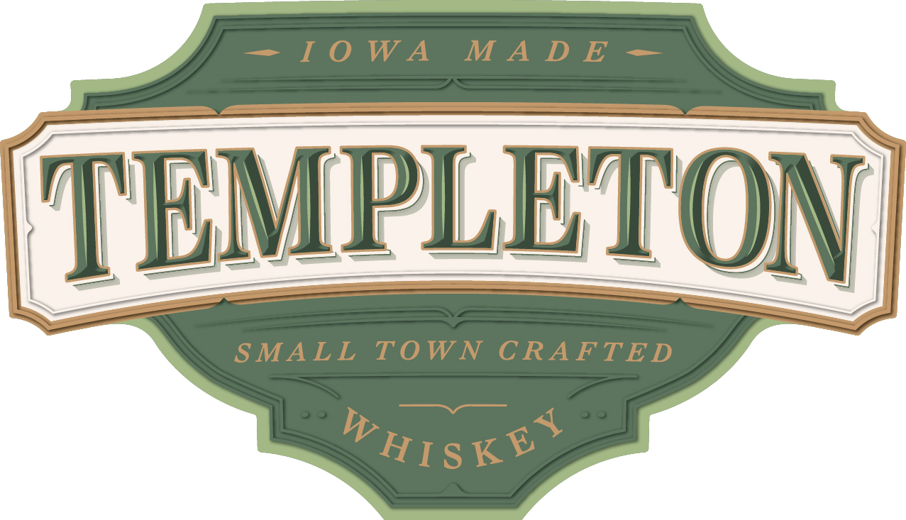
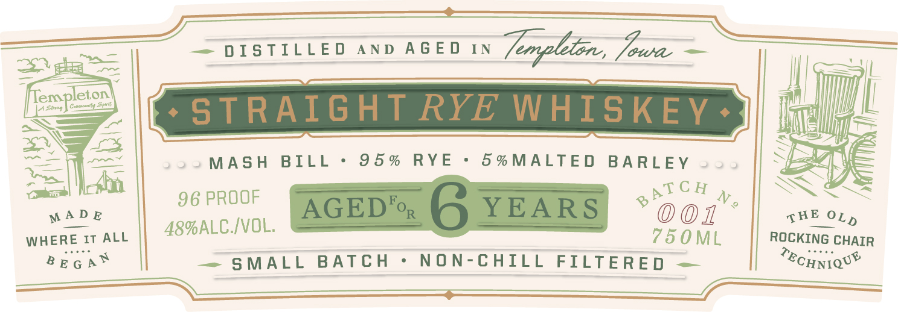
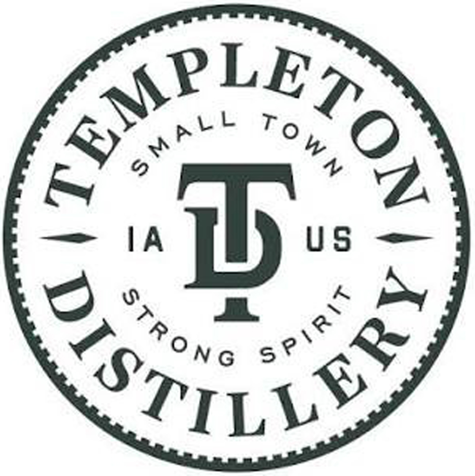
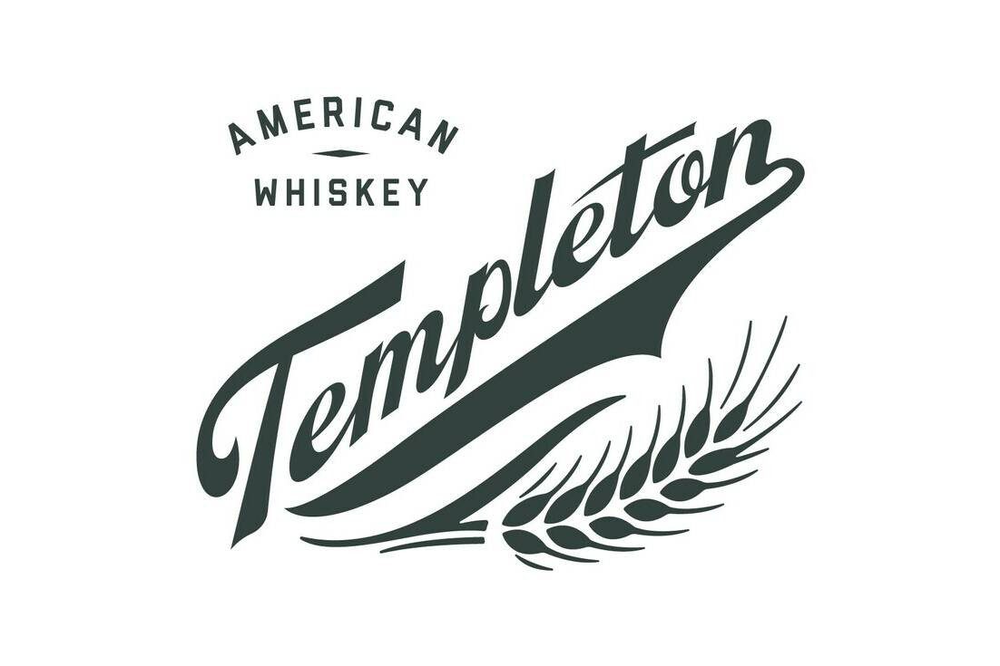
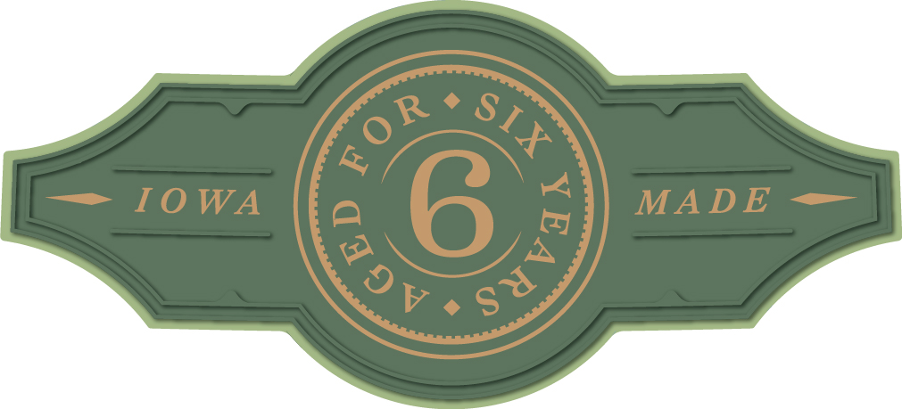

# TTB COLA Label Images - TTBID 26264001000747

**Brand Name:** TEMPLETON

**Issue Date:** 09/23/2026

**Origin Code:** 20

**Product Class/Type:** 102

**Source:** [TTB Public COLA Registry](https://ttbonline.gov/colasonline/viewColaDetails.do?action=publicFormDisplay&ttbid=26264001000747)

## Label Images

### Back Label

### Label 1

### Label 2

### Label 4

### Label 5

### Label 6

## Extracted Label Text

*Text extracted via OCR - may contain errors*

*4 image(s) excluded: text did not meet readability threshold*

**Detected Proof:** 96
**Detected Age:** 6 Years

### Back Label

DISTILLED AND BOTTLED BY TEMPLETON DISTILLERY
TEMPLETON, IOWA USA

GOVERNMENT WARNING: (1) ACCORDING TO THE SURGEON
GENERAL, WOMEN SHOULD NOT DRINK ALCOHOLIC
BEVERAGES DURING PREGNANCY BECAUSE OF THE RISK OF
BIRTH DEFECTS. (2) CONSUMPTION OF ALCOHOLIC
BEVERAGES IMPAIRS YOUR ABILITY TO DRIVE A CAR OR
OPERATE MACHINERY, AND MAY CAUSE HEALTH PROBLEMS.

W5¢-ME 15¢-V115¢-(CA CRY

WWW.TEMPLETONDISTILLERY.COM b>

### Label 2

D I S TILL E D
A N D
A G E D
IN
Tmpleton , Joaa
Templeton
Canane {nn
STRAIGHT RYE WHISKEY
MAs H
BILL
9 5 %
RYE
5 % MALTE D
BA RLEY
96 PROOF
AGEDFor
6YEARS
0
N _
MA D E
0 01
WHERE It
ALL
48%ALC IVOL.
75 0 ML
ROCKING CHAIR
B E G A N
S MALL
B ATC H
N ON-CHILL FILTERED
TEcHNIQUE
ATC H
THE
OLD
