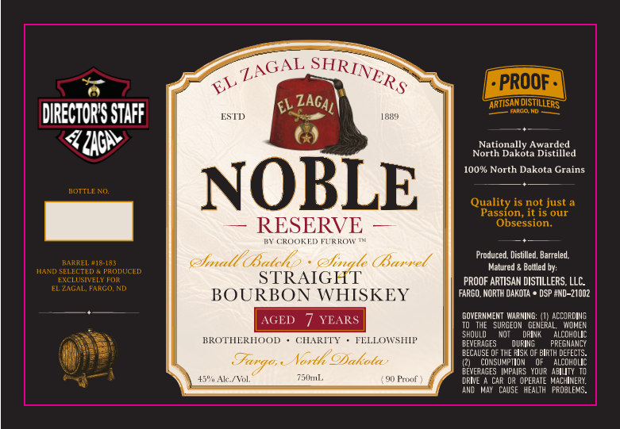

# TTB COLA Label Images - TTBID 26265001000113

**Brand Name:** CROOKED FURROW

**Fanciful Name:** NOBLE RESERVE

**Issue Date:** 09/23/2026

**Origin Code:** 36

**Product Class/Type:** 101

**Source:** [TTB Public COLA Registry](https://ttbonline.gov/colasonline/viewColaDetails.do?action=publicFormDisplay&ttbid=26265001000113)

## Label Images

### Back Label

## Extracted Label Text

*Text extracted via OCR - may contain errors*

### Back Label

EL
PROOF =
l
ARTISAN DISTILLERS
Eando ND
DIRECTORY STAFF
ESTD
1839
'ZAcA)
Nationally Awarded
North Dakota Distilled
10O% North Dakota Grains
BOTTIEEO
NOBLE
Quality is not just
Passion, it is our
RESERVE
Obsession.
BY CROOKED
FURROT
EaaLee lae
emnadl Batchs
ehnale (Banned
Produced, Distilled, Barreled.
HAND SELECTED
PRODUCEC
Matured
Boltled by:
EXCLUSIVELY FOIt
STRAIGHT
PROOF ARTISAN DISTILLERS LLC
EL ZAGAL; FARGo ND
BOURBON WHISKEY
FARGO. NORTH DAKOTA
DSP HND-21002
GOVERMMENT WNARMing:
ACCORDING
AGED
YEARS
SURGEON   GeNeRaL
MOMER
SHOULD
DPINI
alcoholic
BROTHERHOOD
GHARITY
FELLOWSHIP
BEVERAGES
DUPIMG
PREGHANCY
BECAUSE 0F THE Hsk OF BIRTH DEFECTS.
ar*g0 ,
North ODakole
CONSUMPTION
alcoholic
BEVERAGES |mpairs Your AbluTY TO
45"" Alc /Vol;
7MmL
90 Paxuf"
DRIVE
CAR @R OPERATE MachInery;
ANO  May
CAUSE   HEALTH   PROBLEMS.
SHRINERS
ZAGAL
ZAGAL'
