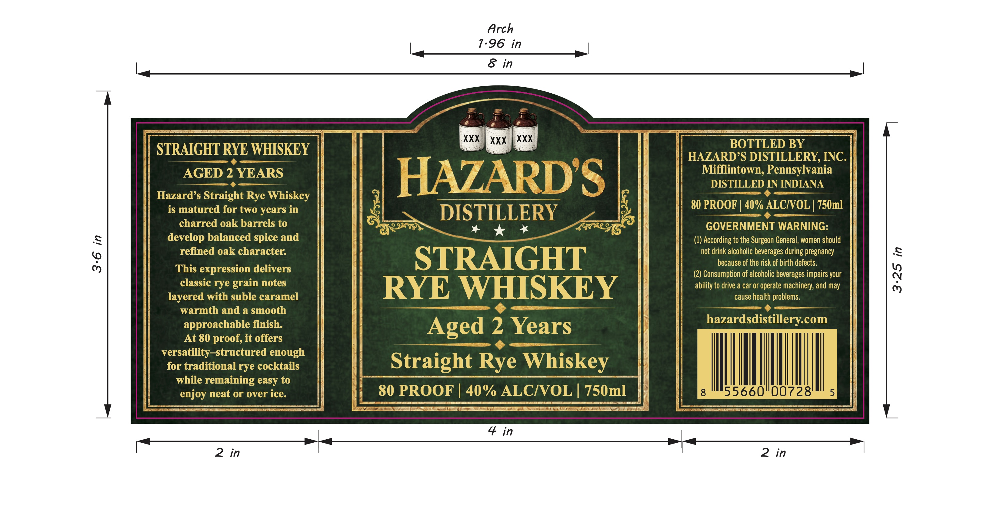

# TTB COLA Label Images - TTBID 26265001000178

**Brand Name:** HAZARD'S DISTILLERY

**Issue Date:** 09/25/2026

**Origin Code:** 39

**Product Class/Type:** 102

**Source:** [TTB Public COLA Registry](https://ttbonline.gov/colasonline/viewColaDetails.do?action=publicFormDisplay&ttbid=26265001000178)

## Label Images

### Label 1

## Extracted Label Text

*Text extracted via OCR - may contain errors*

**Detected Proof:** 80
**Detected Age:** 2 Years

### Label 1

Arch
7.96 in
8 in
XXX
XXX
XXX
BOTTLED BY
STRAIGHT RYE WHISKEY
HAZARD'S DISTILLERY, INC:
AGED 2 YEARS
HAZARDS
Mifflintown; Pennsylvania
DISTILLED IN INDIANA
Hazard'$ Straight Rye Whiskey
is matured for two years in
DISTILLERY
80 PROOF
40% ALCNOL | 750ml
charred oak barrels to
GOVERNMENT WARNING:
develop balanced spice and
(1) According to the Surgeon General, women should
{
refined oak character:
not drink alcoholic beverages during pregnancy
STRAIGHT
because of the risk of birth defects.
This expression delivers
(2) Consumption of alcoholic beverages impairs your
3
classic rye grain notes
RYE WHISKEY
ability to drive a car or operate
machinery; and may
layered with suble caramel
cause health problems
warmth and a smooth
approachable finish:
Aged 2 Years
hazardsdistillery com
At 80 proof, it offers
versatility-structured enough
for traditional rye cocktails
Straight Rye Whiskey
while remaining easy to
enjoy neat or over ice.
80 PROOF
40% ALCIVOL | 750ml
55660"00728'
5
4 in
2
in
2 in
