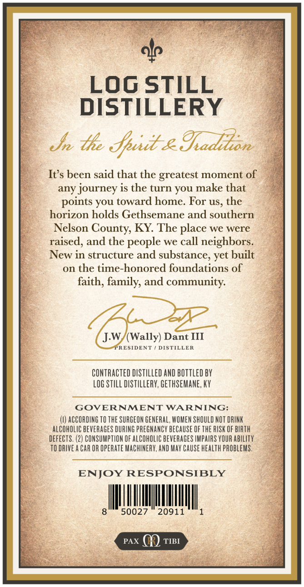
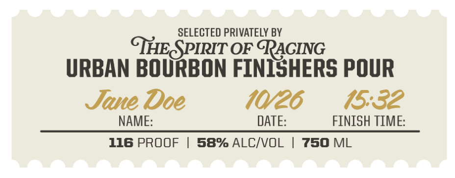

# TTB COLA Label Images - TTBID 26265001000338

**Brand Name:** MONK'S ROAD

**Issue Date:** 09/25/2026

**Origin Code:** 22

**Product Class/Type:** 101

**Source:** [TTB Public COLA Registry](https://ttbonline.gov/colasonline/viewColaDetails.do?action=publicFormDisplay&ttbid=26265001000338)

## Label Images

### Back Label

### Front Label

### Label 3

## Extracted Label Text

*Text extracted via OCR - may contain errors*

*1 image(s) excluded: text did not meet readability threshold*

**Detected Proof:** 116

### Back Label

LOg STILL
DISTILLERY
the Jpuit-&Iadikon
Its been said that the greatest moment of
any journey is the turn you make that
points YOU toward home: For Us, the
horizon holds Gethsemane and southern
Nelson County; KY The place we were
raised, and the people we call neighbors
New in structure and substance; yet built
on the time-honored foundations of
faith; family, and community:
J.W (Wally) Dant III
PRESIDENT
DISTILLER
CONTRACTED DISTILLED AND bOttled BY
LOG StILL dastIlleRV, GEThSEMANE, KY
GOVERNMENT WARNING:
ACCORDING TO the SURGEON GeNERAL, WOMEN ShOULD NOT DRINK
alCOhOLIC BEVERAGES DURING PREGNANCY BECAUSE OF thE RISK OF BIRTH
defects, (2) CONSUMPTLON OF AlCohOLIC beverages IMPAIRS YOUR abIlITy
TO DRIVEA CAR OR operate MAChINERY, AND MAY Cause health pRObLEMS ,
ENJOY RESPONSIBLY
50027
20911
PAX
TIBI

### Front Label

SELECTED PRIVATELY BY
THESPIRIT OE TAGING
URBAN BOURBON FINISHERS POUR
Jane Doe
10/26
15.32
NAME:
DATE:
FINISH TIME:
116 PROOF
58% ALCIVOL
750 ML
