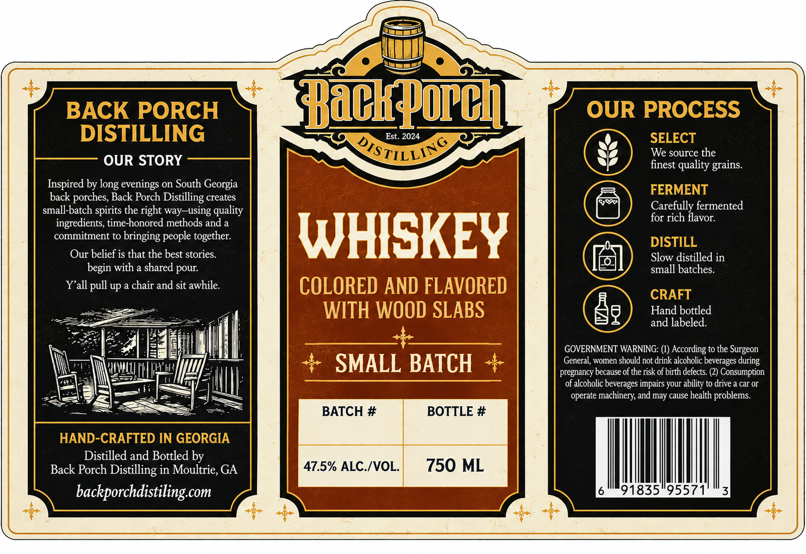
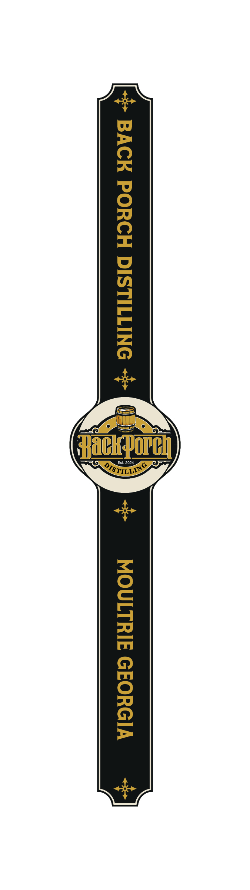

# TTB COLA Label Images - TTBID 26265001000435

**Brand Name:** BACK PORCH DISTILLING

**Issue Date:** 10/02/2026

**Origin Code:** 08

**Product Class/Type:** 140

**Source:** [TTB Public COLA Registry](https://ttbonline.gov/colasonline/viewColaDetails.do?action=publicFormDisplay&ttbid=26265001000435)

## Label Images

### Label 1

### Label 2

## Extracted Label Text

*Text extracted via OCR - may contain errors*

*1 image(s) excluded: text did not meet readability threshold*

**Detected Proof:** 95

### Label 1

BACK PORCH
Hackporch
OUR PROCESS
DISTILLING
Est. 2024
SELECT
OTSTILLING
We source the
OUR STORY
finest quality grains.
Inspired by
evenings on South Georgia
FERMENT
back porches, Back Porch Distilling creates
small-batch
the right way-using quality
Carefully fermented
ingredients, time-honored methods and a
for rich flavor:
commitment to bringing people together:
WHISKEY
DISTILL
Our belief is that the best stories:
Slow distilled in
begin with a shared pour:
small batches:
Yall
up a chair and sit awhile:
COLORED AND FLAVORED
CRAFT
WITH WOOD SLABS
Hand bottled
and labeled.
GOVERNMENT WARNING: (1) According to the Surgeon
SMALL BATCH
General, women should not drink alcoholic beverages during
pregnancy because of the risk of birth defects (2) Consumption
of alcoholic beverages impairs your ability to drive a car Or
operate machinery, and may cause health problems:
BATCH #
BOTTLE #
HAND-CRAFTED IN GEORGIA
Distilled and Bottled by
Back Porch Distilling in Moultrie, GA
47.5% ALC.IVOL.
750 ML
backporchdistiling com
91835"95571
3
long
spirits
pull
