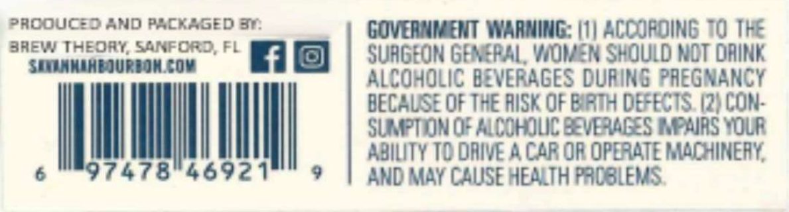
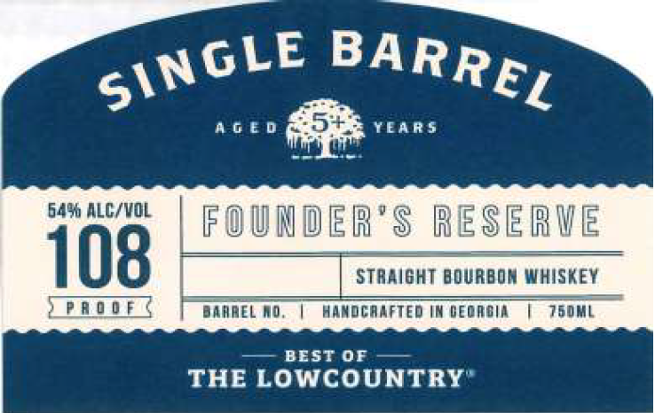
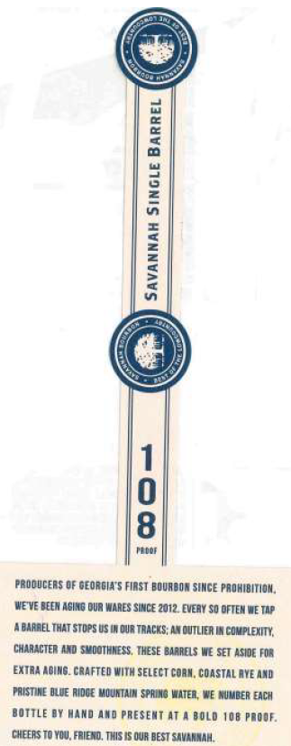

# TTB COLA Label Images - TTBID 26265001000530

**Brand Name:** FOUNDER'S RESERVE

**Fanciful Name:** SINGLE BARREL

**Issue Date:** 10/01/2026

**Origin Code:** 16

**Product Class/Type:** 101

**Source:** [TTB Public COLA Registry](https://ttbonline.gov/colasonline/viewColaDetails.do?action=publicFormDisplay&ttbid=26265001000530)

## Label Images

### Back Label

### Front Label

### Label 3

## Extracted Label Text

*Text extracted via OCR - may contain errors*

### Back Label

anew Tacomy sanroroF. ra way | SURGEON GEAGRAL WOKEN SHOULD NOT ORIN
ee ALCOHOLIC BEVERAGES DURING PREGNANCY

BECAUSE OF THE RISK OF BIRTH DEFECTS. (2) CON-
IN OF ALCOHOLIC BEVERAGES IMPAIRS YOUR

SUMPTION OF ALCOHO!
ABILITY TO DRIVE A CAR OR OPERATE MACHINERY,
AND MAY CALISE HEALTH PROBLEMS.

### Front Label

4 g € 0
5'
earS
6496 ALC/VOL
FOUUDER'$ RESERHE
108
StraIGHT BOURBON WHISKEY
D
DamaEL Md
handcaafted Im deomgin
'7b0mL
BEST OF
THE LOWCOUNTRY
BARREL
SINGLE

### Label 3

]
1
I
8
codf
prudlcens @F GEORELA $ FiRST BOUAA O R SINGE PAOHIBIT OU ,
WEVE BEEH ABLYG DUR WAAES SINCE 2012.EVERY Sq OFtEM WE Tap
A baraEL ThaT Stops US IRDUR TRACKS; A Y dutlFFA TR coM pleXITU;
CHARACTER A4d $wdotHness, THese BAARELS WE SET Asije F0r
EXTAA HoUnG_ CRAFTEd With Select Coan, COaSTaL AvE AXd
DristiaE IlVE RiduE MO UnTAIA SPRING WATEL,
A UMCER EAcd
BOTTLE BY Hand Axd PresenT AT
0 OLd T0B POQOF
cheers T0 YOU, FDIERO, THIS IS QUR BEST SAVARRAH
