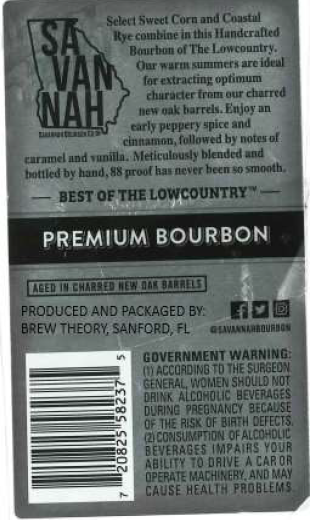
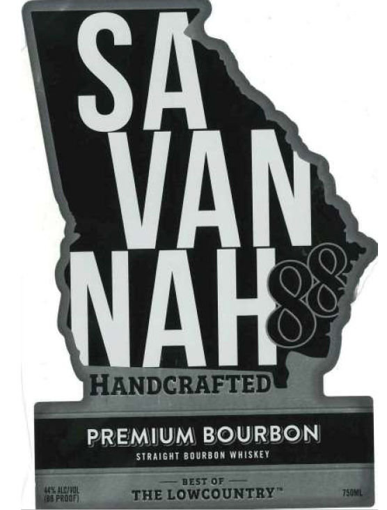
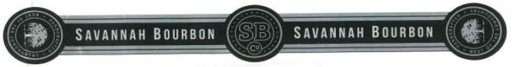

# TTB COLA Label Images - TTBID 26265001000558

**Brand Name:** SAVANNAH 88

**Fanciful Name:** PREMIUM BOURBON

**Issue Date:** 10/01/2026

**Origin Code:** 16

**Product Class/Type:** 101

**Source:** [TTB Public COLA Registry](https://ttbonline.gov/colasonline/viewColaDetails.do?action=publicFormDisplay&ttbid=26265001000558)

## Label Images

### Back Label

### Front Label

### Label 3

## Extracted Label Text

*Text extracted via OCR - may contain errors*

*1 image(s) excluded: text did not meet readability threshold*

### Back Label

Selct | Eweet Cornonu Cuastul
Sh
Ukyc cotpbine in Itlis Hundcralled
Bautben o( TbeLuwconntr}
Qurtuectt
ure iuc
VAM
fareraating optimum
churaclee tremi our churred
NAH
lek O4L barreka Eajoy on
crly p4ppeT } spice And
cinttatuon; followed by notes pf
rrnel and vunilla . Meticulbusly blended und
butlked by hand. 88 grodl kas nevcr becn
smaxtb
BEST OF THE LOWICOUNTRY
PREMIUM BOURBON
LEEL
FRODUCED AND PACKAGED BY:
MO@
BREW THEORY,SANFORD;FL
Mamo
GOVERNMENT WARNING
(accoad notdtue surddox
GI NERAL Women shouldnot
Loholic BEVe74g
dfINC pneg NaNCY @EC45E
PLSK DF BIaTI DEFECTS
@iconsu aooN ofalcoyplg
ERAGES
MS YOUR
J0a4,
ACAROR
operaE MACHIRERY. ANdmay
Cause HealTM FrobLeMS
u

### Front Label

SA
VAN
NAHes
HANDCRAFTED
PREMIUM BOURBON
Straight BOURbdm WhiSkey
BEST OF
TPRoU
THE LOWCOUNTRY
150YL
