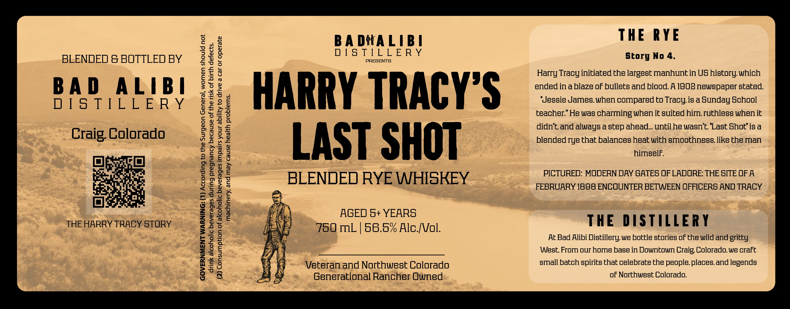

# TTB COLA Label Images - TTBID 26265001000668

**Brand Name:** BAD ALIBI DISTILLERY

**Fanciful Name:** HARRY TRACY'S LAST SHOT BLENDED RYE WHISKEY

**Issue Date:** 09/24/2026

**Origin Code:** 13

**Product Class/Type:** 132

**Source:** [TTB Public COLA Registry](https://ttbonline.gov/colasonline/viewColaDetails.do?action=publicFormDisplay&ttbid=26265001000668)

## Label Images

### Back Label

## Extracted Label Text

*Text extracted via OCR - may contain errors*

**Detected Proof:** 117

### Back Label

2
BA DMA LIB A
THE
RYE
BLENDED & BOTTLED BY
Wu
D [ S T[LL E R Y
PRESENTS
story No 4.
6
W
Harry Tracy initiated the largest manhuntin US history;which
BA D
ALIB |
0
HARRY TRACY'S
ended inablaze oF bullets and blood.A 1908newspaper stated
D [ S TILL E R Y
J
9
'Jegsie James.when compared to Tracy;i8 a Bunday Echool
0
L
teacher" He Was
charming when it suted him ruthless when it
Hj
didn't and aluays astep ahead_untilhe wasn't Last 8hot"i8a
Craig Colorado
W
LAST SHOT
blended rye that balances heat with smoothness like the man
9
i
himself
H
2
BLENDED RYE WHISKEY
PICTURED: MODERN DAY GATES OF LADORE: THE SITE OF A
3
8
FEBRUARY 1898 ENCOUNTER BETWEEN OFFICERS AND TRACY
2
U
H
AGED 5+ YEARS
THE HARRY TRACY STORY
53
750ML
58.5% Alc [Vol.
THE
D ISTILLERY
At Bad Alibi
Distillery we bottle stories oFthe wild and gritty
V
West From our home base in Downtown Craig Colorado,we craft
1
Veteran and Northwest Colorado
small batch spirits that celebrate the people places.and legends
Generational Rancher Owned
oF Northwest Colorado.
