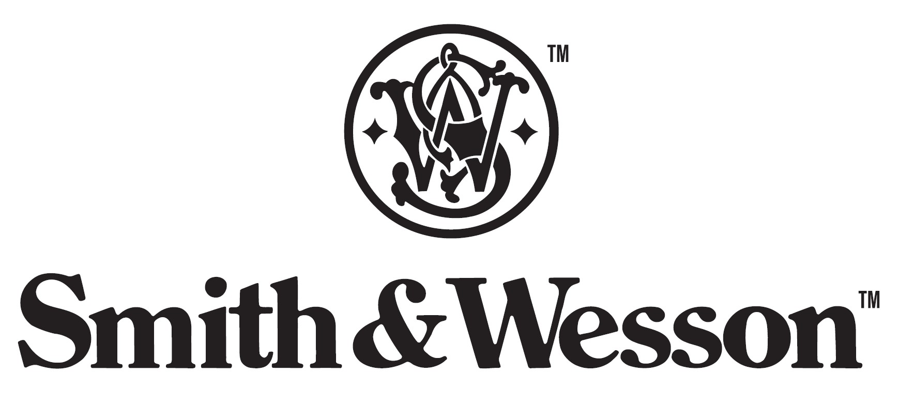
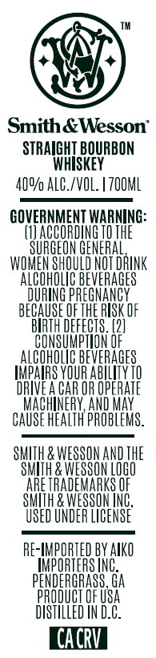

# TTB COLA Label Images - TTBID 26266001000201

**Brand Name:** SMITH & WESSON

**Issue Date:** 09/28/2026

**Origin Code:** 08

**Product Class/Type:** 101

**Source:** [TTB Public COLA Registry](https://ttbonline.gov/colasonline/viewColaDetails.do?action=publicFormDisplay&ttbid=26266001000201)

## Label Images

### Back Label

### Label 1

## Extracted Label Text

*Text extracted via OCR - may contain errors*

*1 image(s) excluded: text did not meet readability threshold*

### Label 1

Smith& Wesson"
STRAIGHI BQURBON
WhiSKeY
4Q9/ ALC_/VOL: | ZOOML
GOVERNMENT WARNING:
(I) ACCORDING TO THE
SURGEON GENERAL
WOMEN Should NOT DRINK
alcoholic BEVERAGES
DURING PREGNANCY
BEGAUSE _F THE RISK uF
BIRTH DEFFCTS .
COnSuMpIONL
821
BEVERAGES
UeHE
YOUR AbiLLIY T0
DRIVE A CAR OR OPERATE
MAchINERY,AND MAY
CAUSE HEALTH PROBLEMS_
SMITH & WESSON AND THE
Swih & WESSON LOGO
ARE TRADEMARKS F
SMh & WESSON INC
USED UNDER LICENSE
RE-IMPORTED BY AIKO
HpORTERS INC
PENDERGRASS, Ga
PRODUCT OF USA
DISTHLLED IN D.C:
CACRV
