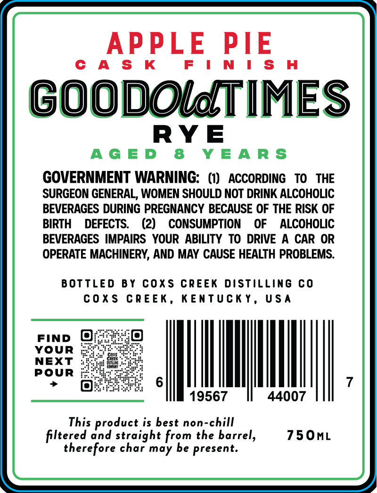
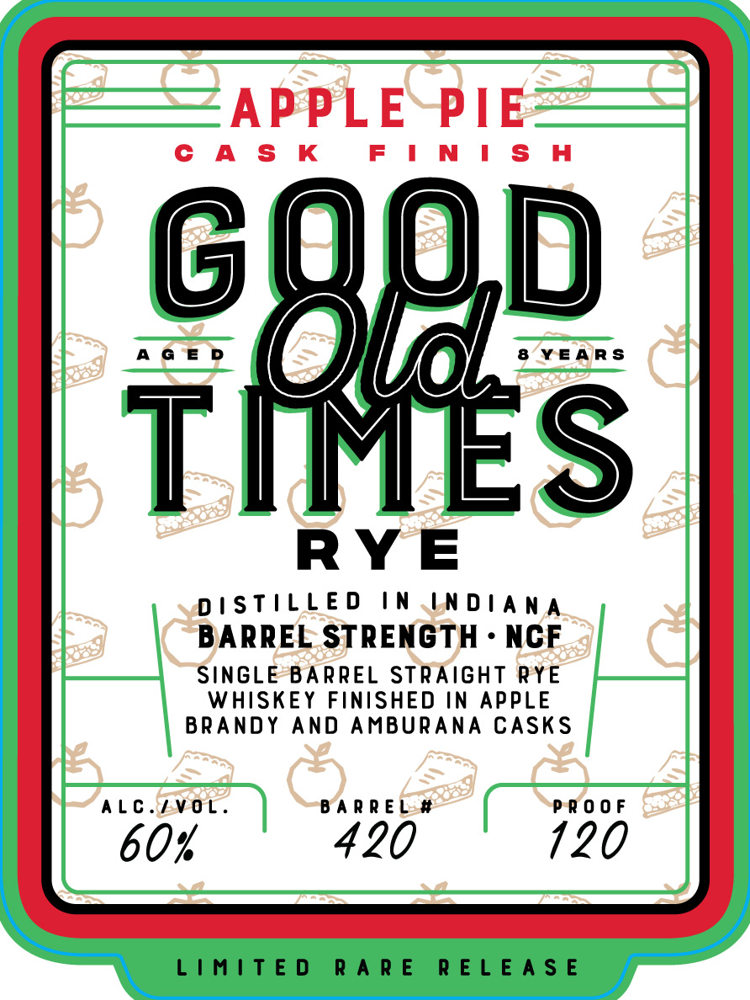

# TTB COLA Label Images - TTBID 26266001000256

**Brand Name:** GOOD OLD TIMES

**Fanciful Name:** APPLE PIE

**Issue Date:** 09/30/2026

**Origin Code:** 22

**Product Class/Type:** 102

**Source:** [TTB Public COLA Registry](https://ttbonline.gov/colasonline/viewColaDetails.do?action=publicFormDisplay&ttbid=26266001000256)

## Label Images

### Back Label

### Front Label

## Extracted Label Text

*Text extracted via OCR - may contain errors*

**Detected Proof:** 120
**Detected Age:** 8 Years

### Back Label

APPLE PIE

CAS K

FINISH

GOODOlMTIMES

RYE

AGED 8 YEARS

GOVERNMENT WARNING: (1) ACCORDING TO THE

SURGEON GENERAL, WOMEN SHOULD NOT DRINK ALCOHOLIC

BEVERAGES DURING PREGNANCY BECAUSE OF THE RISK OF

BIRTH DEFECTS. (2) CONSUMPTION OF ALCOHOLIC

BEVERAGES IMPAIRS YOUR ABILITY TO DRIVE A CAR OR

OPERATE MACHINERY, AND MAY CAUSE HEALTH PROBLEMS.

BOTTLED BY COXS CREEK DISTILLING CO

COXS CREEK, KENTUCKY, USA

FIND @

YOUR

NEXT

POUR

MI

|

19567

44007

This product is best non-chill

750mL

filtered and straight from the barrel,

therefore char may be present.

### Front Label

APPLE~PIE

CAS K

FINISH

0

AGED

8 YEARS

OSes

\

RYE

DISTILLED IN .LNDIANA

BARREL STRENGTH - NCF

SINGLE BARREL STRAIGHT RYE

WHISKEY FINISHED IN APPLE

BRANDY AND AMBURANA CASKS

ALC./VOL.

BARREL. #

PROOF

60%

420

120

LIMITED RARE RELEASE
