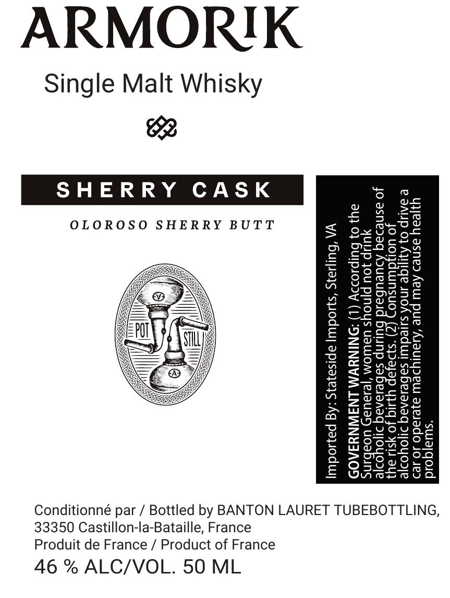

# TTB COLA Label Images - TTBID 26266001000298

**Brand Name:** ARMORIK

**Fanciful Name:** SHERRY CASK

**Issue Date:** 10/05/2026

**Origin Code:** 51

**Product Class/Type:** 118

**Source:** [TTB Public COLA Registry](https://ttbonline.gov/colasonline/viewColaDetails.do?action=publicFormDisplay&ttbid=26266001000298)

## Label Images

### Label 1

## Extracted Label Text

*Text extracted via OCR - may contain errors*

**Detected Proof:** 92

### Label 1

ARMORIK

Single Malt Whisky

Be

SHERRY CAS

*swiajqoud

ujjeay asnes Aew pue ‘Ayaulydew a}esado JO Je

@ IAUP 0} Ayjige sNoA sureduul sabesaraq doyooje
Jo Uol}dWNsuO
Jo asnedaq Adueubal

YUP Jou pjno

ay} 0} bulpso20y NINYVM LNSWNYSA0D

WA ‘buliays ‘sod apisazeys :Ag payioduy|

OLOROSO SHERRY BUTT

Conditionné par / Bottled by BANTON LAURET TUBEBOTTLING,

33350 Castillon-la-Bataille, France

Produit de France / Product of France

46 % ALC/VOL. 50 ML
