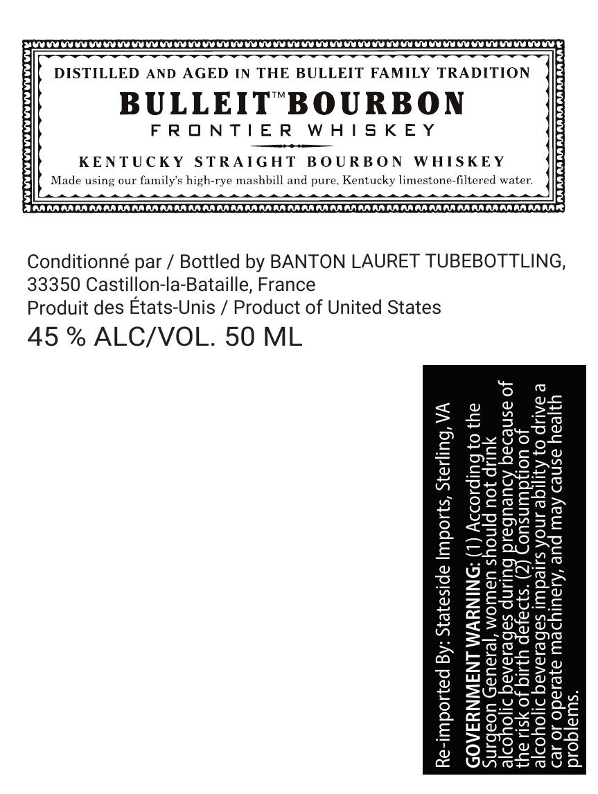

# TTB COLA Label Images - TTBID 26266001000299

**Brand Name:** BULLEIT

**Fanciful Name:** BOURBON FRONTIER WHISKEY

**Issue Date:** 10/06/2026

**Origin Code:** 00

**Product Class/Type:** 101

**Source:** [TTB Public COLA Registry](https://ttbonline.gov/colasonline/viewColaDetails.do?action=publicFormDisplay&ttbid=26266001000299)

## Label Images

### Label 1

## Extracted Label Text

*Text extracted via OCR - may contain errors*

**Detected Proof:** 90

### Label 1

DISTILLED AND AGED IN THE BULLEIT FAMILY TRADITION

BULLEIT"BOURBON

FRONTIER WHISKEY

KENTUCKY STRAIGHT BOURBON WHISKEY

Made using our family’s high-rye mashbill and pure, Kentucky limestone-filtered water:

Conditionné par / Bottled by BANTON LAURET TUBEBOTTLING,
33350 Castillon-la-Bataille, France
Produit des Etats-Unis / Product of United States

45 % ALC/VOL. 50 ML

because of
on of
y

s your ability to drive a

According to the

women should not drink

es durin

a)
regnanc
fects. (2) Consump’
pa

tS

je
perate machinery, and may cause health

‘on General
problems.

olic bevera

Shi

<x
>
a
=
=
o
x
Ma)
wa
Bi)
=
fe)
a
=
w
ne]
ral
wv
x
S
s
Ya)
Sh
a
a2)
a
£
=
fe)
a
£
7
wv
a

GOVERNMENT WARNING: (1
the risk of birth
alcoholic bevera

car or o|

Sur
alc
