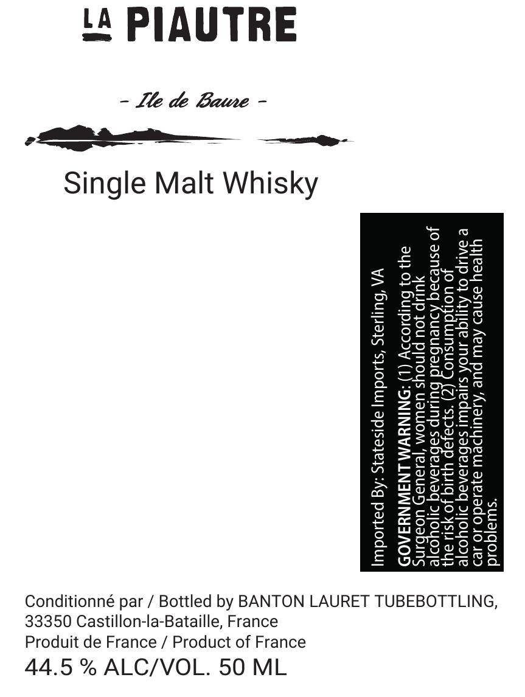

# TTB COLA Label Images - TTBID 26266001000328

**Brand Name:** LA PIAUTRE

**Fanciful Name:** ILE DE BAURE SINGLE MALT

**Issue Date:** 10/05/2026

**Origin Code:** 51

**Product Class/Type:** 118

**Source:** [TTB Public COLA Registry](https://ttbonline.gov/colasonline/viewColaDetails.do?action=publicFormDisplay&ttbid=26266001000328)

## Label Images

### Label 1

## Extracted Label Text

*Text extracted via OCR - may contain errors*

**Detected Proof:** 89

### Label 1

{8 PIAUTRE

- Lle de Dawe -

ingle Malt Whisky

S

“swiajqoud
yyeay asne> Aew pue ‘Asaulyrew ajesado Jo 429
@ DAUP 0} Ajijige ANOA sted! sabesanaq
Jo uo! duineue st *syajap YUIG J
Jo asnedaq ADueubaid bul

Np sebeseraq I1|0Yyod|/e
UIP JOU Pjnoys UIWOM ‘|eJaUa5 Uoabins
24} 0} Bulps02> (L) “ONINYWM LNSWNYSAOD

WA ‘buliays ‘sjsoduuy] apisayeys :Ag payioduu

Conditionné par / Bottled by BANTON LAURET TUBEBOTTLING,

33350 Castillon-la-Bataille, France

Produit de France / Product of France

44.5 % ALC/VOL. 50 ML
