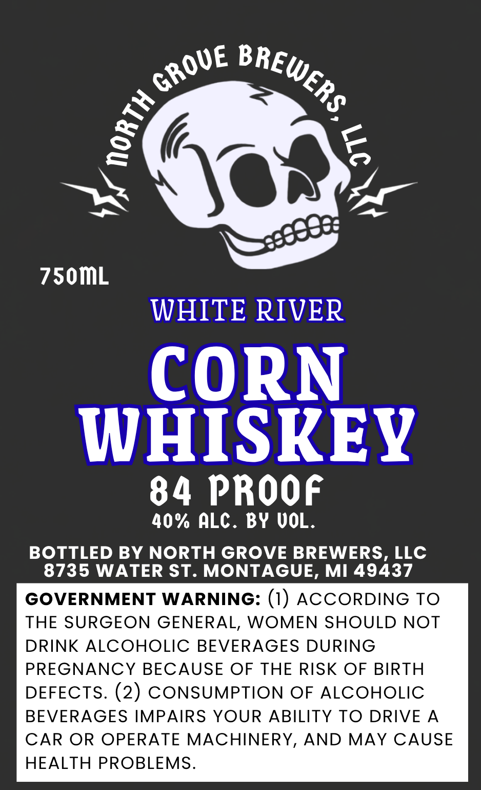

# TTB COLA Label Images - TTBID 26266001000368

**Brand Name:** NORTH GROVE BREWERS, LLC

**Fanciful Name:** WHITE RIVER

**Issue Date:** 09/30/2026

**Origin Code:** 06

**Product Class/Type:** 143

**Source:** [TTB Public COLA Registry](https://ttbonline.gov/colasonline/viewColaDetails.do?action=publicFormDisplay&ttbid=26266001000368)

## Label Images

### Label 1

## Extracted Label Text

*Text extracted via OCR - may contain errors*

**Detected Proof:** 84

### Label 1

750mL
WHITE RIVER
CORN
WHISKEY
84 PROOF
40% ALC . BY UOL.
BOTTLED BY NORTH GROVE BREWERS, LLC
8735 WATER ST. MONTAGUE, MI 49437
GOVERNMENT WARNING: (1) ACCORDING TO
THE SURGEON GENERAL, WOMEN SHOULD NOT
DRINK ALCOHOLIC
BEVERAGES DURING
PREGNANCY BECAUSE OF THE RISK OF BIRTH
DEFECTS. (2) CONSUMPTION OF ALCOHOLIC
BEVERAGES IMPAIRS YOUR ABILITY TO DRIVE
A
CAR OR OPERATE MACHINERY, AND
MAY CAUSE
HEALTH PROBLEMS.
GROUE
BREWERs
{
6
