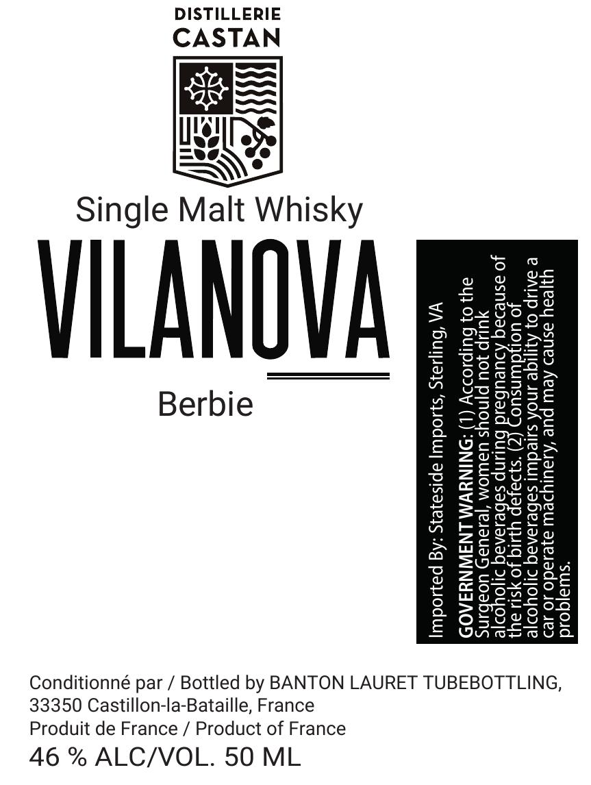

# TTB COLA Label Images - TTBID 26266001000410

**Brand Name:** VILANOVA

**Fanciful Name:** BERBIE SINGLE MALT

**Issue Date:** 10/06/2026

**Origin Code:** 51

**Product Class/Type:** 118

**Source:** [TTB Public COLA Registry](https://ttbonline.gov/colasonline/viewColaDetails.do?action=publicFormDisplay&ttbid=26266001000410)

## Label Images

### Label 1

## Extracted Label Text

*Text extracted via OCR - may contain errors*

**Detected Proof:** 92

### Label 1

DISTILLERIE

CASTAN

Single Malt Whisky

vLANOU!

“swuajqoud
ujeay asned Aew pue ‘Ajaulydew ajesado Jo Je
@ DAUP 0} Aqijige JNOA ssleduut sabesanaq >.
jo Lone ©) “s}Dajap YI
Jo asnesaq

ueubas
yUUIp jou pin
34} 0} bulpioddy

ULUNp Sebesanaq I
UaLUOM ‘|e1aua5) UOabins
ONINYVM LNAWNYAA0D

VA ‘Bulsays ‘saodw apisayeys :Ag payodwy|

Conditionné par / Bottled by BANTON LAURET TUBEBOTTLING,

33350 Castillon-la-Bataille, France

Produit de France / Product of France

46 % ALC/VOL. 50 ML
