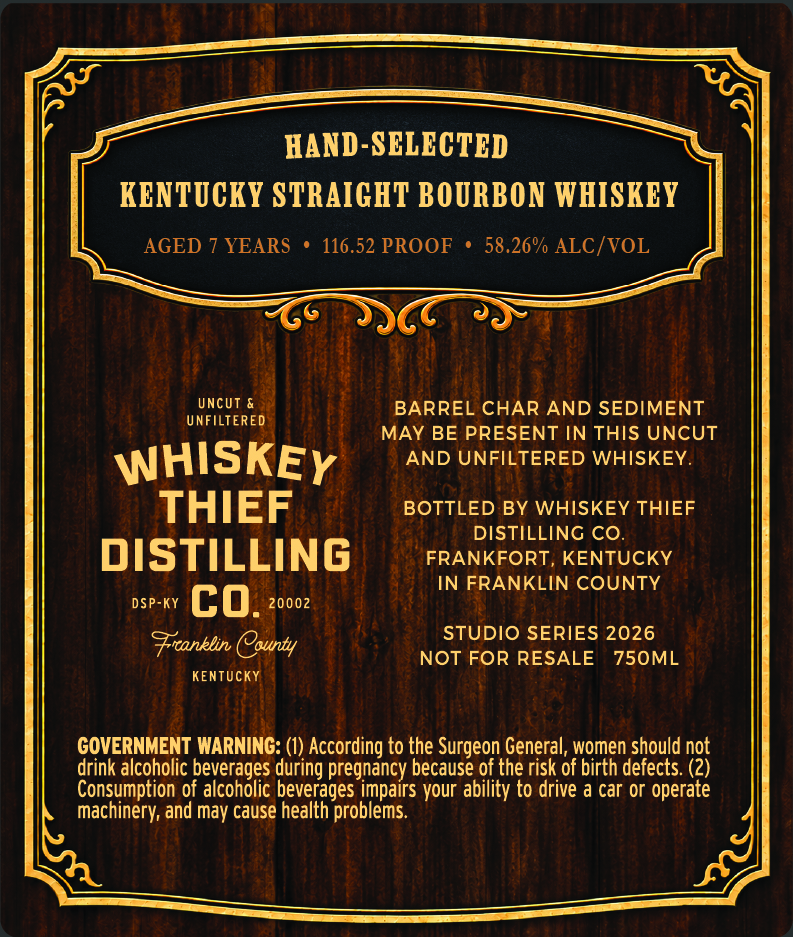
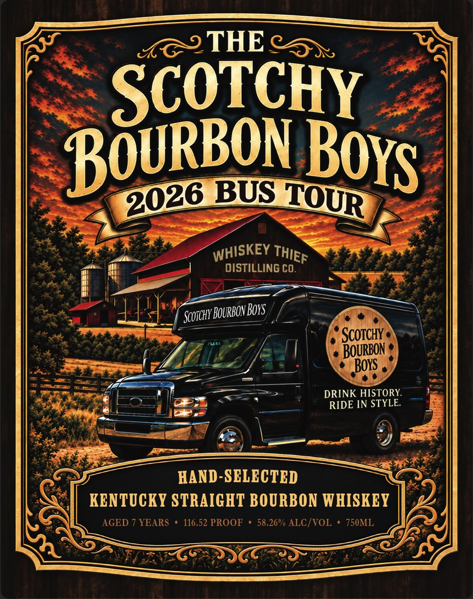

# TTB COLA Label Images - TTBID 26266001000445

**Brand Name:** WHISKEY THIEF DISTILLING CO.

**Fanciful Name:** SCOTCHY BOURBON BOYS

**Issue Date:** 09/28/2026

**Origin Code:** 22

**Product Class/Type:** 101

**Source:** [TTB Public COLA Registry](https://ttbonline.gov/colasonline/viewColaDetails.do?action=publicFormDisplay&ttbid=26266001000445)

## Label Images

### Back Label

### Front Label

## Extracted Label Text

*Text extracted via OCR - may contain errors*

**Detected Proof:** 116.5
**Detected Age:** 7 Years

### Back Label

HAND-SELECTED
KENTOCKY STRAIGHT BOORBON WHISKEY
AGED
YEARS
116.52 PROOF
58.26% ALC/VOL
UncUt &
BARREL CHAR AND SEDIMENT
UNFILTERED
MAY BE PRESENT IN THIS UNCUT
WHISKEY
AND UNFILTERED WHISKEY
THIEF
BOTTLED BY WHISKEY THIEF
DISTILLING CO.
DISTILLING
FRANKFORT, KENTUCKY
IN FRANKLIN COUNTY
DSP-KY
co.
20002
STUDIO SERIES 2026
Frconklin County
NOT FOR RESALE
750ML
KENTUcKY
GOVERNMENT WARNING:
According to the Surgeon General;,women should not
drink alcoholic beverages during pregnancy because of the risk of birth defects (2)
Consumption of alcoholic beverages impairs your ability to drive
car or operate
machinery; and may Cause health problems:

### Front Label

9
THE
SCOTCHY
BUS
DISTILLING CO .
'BourBOv Boxs
ScOTCHY
BOuRBon
Boys
DRINK HISTORY
RIDE IN STYLE
HAND-SCLECTCD
KENTUCKY STRAIGHT BOURBON WHISKEY
AGED 7 YEARS
116.52 PROOF
58.26% ALC/VOL
750ML
BOURBON
Boys
2026
TOWR
WHISKEY
THIEF
Scoichy [
