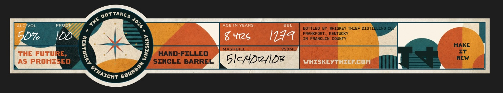
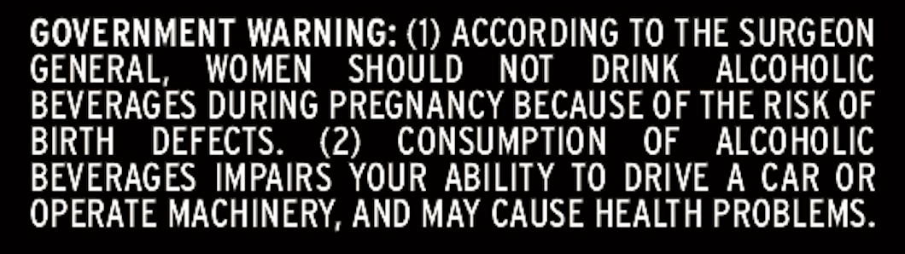

# TTB COLA Label Images - TTBID 26266001000448

**Brand Name:** WHISKEY THIEF DISTILLING CO.

**Issue Date:** 09/29/2026

**Origin Code:** 22

**Product Class/Type:** 101

**Source:** [TTB Public COLA Registry](https://ttbonline.gov/colasonline/viewColaDetails.do?action=publicFormDisplay&ttbid=26266001000448)

## Label Images

### Label 1

### Label 2

### Label 3

### Label 4

## Extracted Label Text

*Text extracted via OCR - may contain errors*

*1 image(s) excluded: text did not meet readability threshold*

**Detected Age:** 8 Years

### Label 1

STRAIGHT
FROM
THE
BARREL
WHISKEY
THIEF
DISTILLING
co.

### Label 2

OUTTAKES
ALGivol
P
AGE IN YEAPS
BBL
BOTTLED BY WHISKEY THIEF DISTT
LIING'C0
Do7o
DD
8 Yrs
I144
ERAFRAORT INKEOUTKY
MAKE
MSHBM
750M1
THE Futurc;
HAND-FILLED
IT
AS PRONISED
SINGLE BARREL
5lc/4D1ldr
WHISKEYTHEERcN
NEV
ThE
1
)
(
Bourbon
STRAICHT

### Label 3

GOVERNMENT WARNING: (1) ACCORDING TO THE SURGEON

GENERAL, WOMEN SHOULD NOT DRINK ALCOHOLIC

BEVERAGES DURING PREGNANCY BECAUSE OF THE RISK OF

BIRTH DEFECTS.

(2) CONSUMPTION OF ALCOHOLIC

BEVERAGES IMPAIRS YOUR ABILITY TO DRIVE A CAR OR

OPERATE MACHINERY, AND MAY CAUSE HEALTH PROBLEMS.
