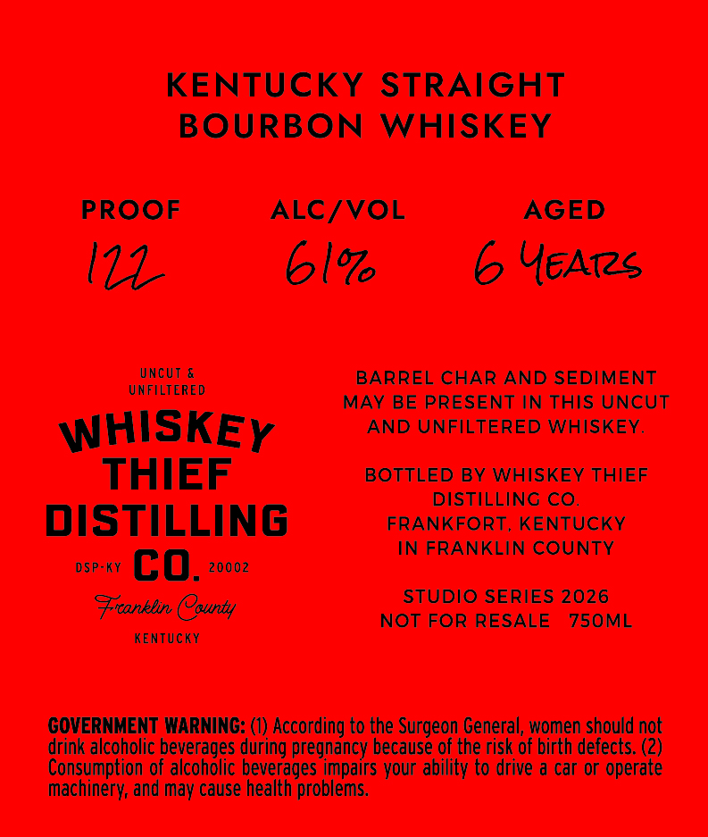
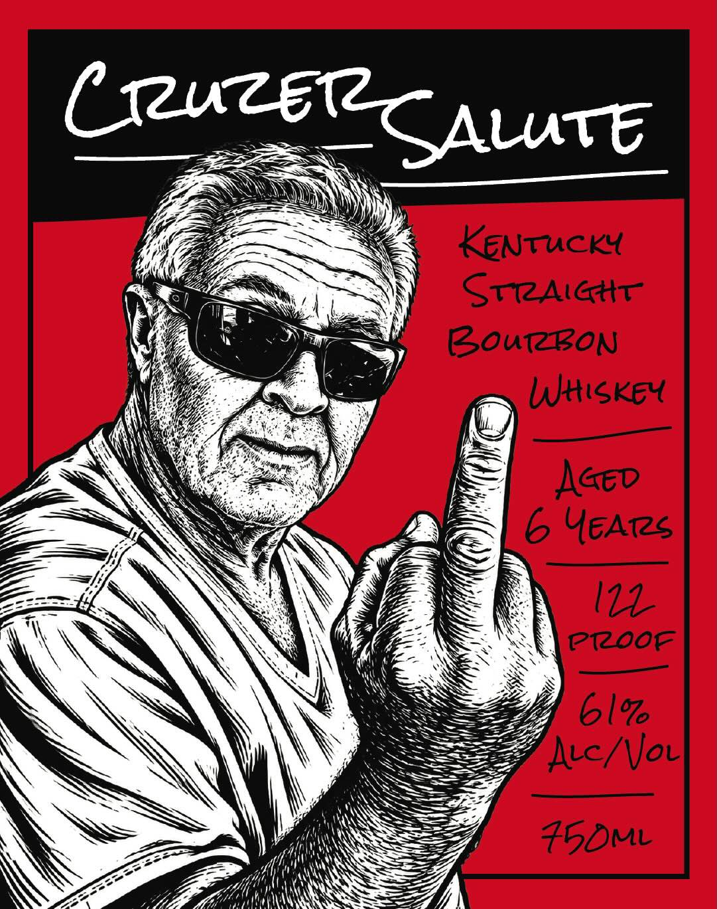

# TTB COLA Label Images - TTBID 26266001000456

**Brand Name:** WHISKEY THIEF DISTILLING CO.

**Issue Date:** 09/29/2026

**Origin Code:** 22

**Product Class/Type:** 101

**Source:** [TTB Public COLA Registry](https://ttbonline.gov/colasonline/viewColaDetails.do?action=publicFormDisplay&ttbid=26266001000456)

## Label Images

### Back Label

### Front Label

## Extracted Label Text

*Text extracted via OCR - may contain errors*

### Back Label

KENTUCKY STRAIGHT
BOURBON
WHISKEY
PROOF
ALC/VOL
AGED
I14
6l0
6 YEAis
Uncut &
BARREL CHAR AND SEDIMENT
UNFILTERED
MAY BE PRESENT IN THIS UNCUT
WHISKEY
AND UNFILTERED WHISKEY.
THIEF
BOTTLED BY WHISKEY THIEF
DISTILLING CO.
DISTILLING
FRANKFORT, KENTUCKY
IN FRANKLIN COUNTY
DSP-KY
CO.
20002
STUDIO SERIES 2026
Frcanklin County
NOT FOR RESALE
750ML
KEnTUcKY
COVERNMENT WARNING: (0) According to the Surgeon General, women should not
drink alcoholic beverages during pregnancy because of the risk of birth defects.
Consumption of alcoholic beverages impairs your ability to drive & car or operate
machinery; and may cause health problems.

### Front Label

CruzsiCAlutt
Kentucky
SrRAattt
Bourgon
Wttiske
AGev
YEATs
pioof
6l%
Aec/ Voel
45D1
