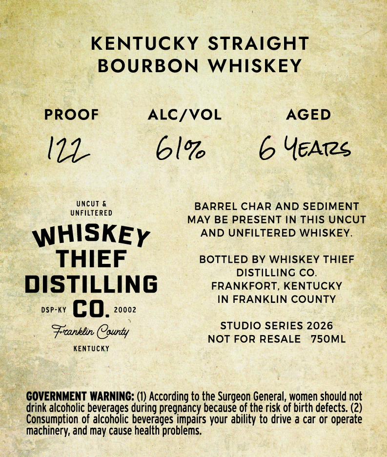
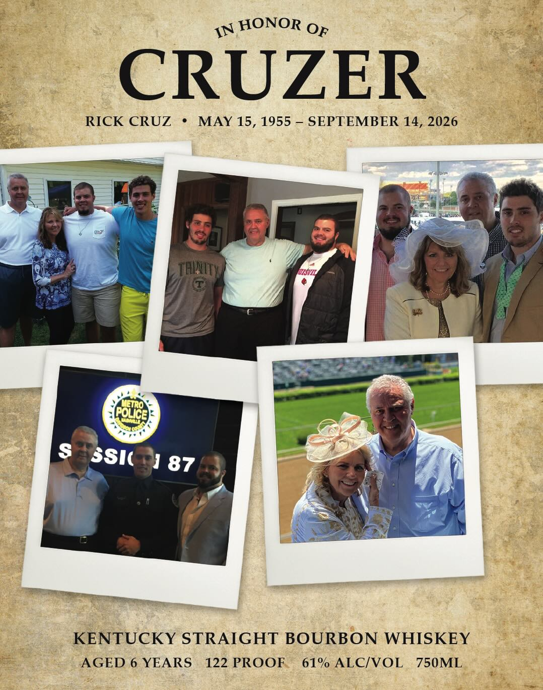

# TTB COLA Label Images - TTBID 26266001000461

**Brand Name:** WHISKEY THIEF DISTILLING CO.

**Issue Date:** 09/29/2026

**Origin Code:** 22

**Product Class/Type:** 101

**Source:** [TTB Public COLA Registry](https://ttbonline.gov/colasonline/viewColaDetails.do?action=publicFormDisplay&ttbid=26266001000461)

## Label Images

### Back Label

### Front Label

## Extracted Label Text

*Text extracted via OCR - may contain errors*

**Detected Proof:** 122
**Detected Age:** 6 Years

### Back Label

KENTUCKY STRAIGHT

BOURBON WHISKEY

PROOF

ALC/VOL

AGED

eZ

61%

6 YEAtes

UNCUT &

BARREL CHAR AND SEDIMENT

UNFILTERED

MAY BE PRESENT IN THIS UNCUT

AND UNFILTERED WHISKEY.

WHISKEy

THIEF

BOTTLED BY WHISKEY THIEF

DISTILLING CO.

DISTILLING

FRANKFORT, KENTUCKY

IN FRANKLIN COUNTY

DSP-KY CO. Jase

Franklin (purty

STUDIO SERIES 2026

KENTUCKY

NOT FOR RESALE 750ML

GOVERNMENT WARNING: (1) According to the Surgeon General, women should not

drink alcoholic beverages during pregnancy because of the risk of birth defects. (2)

Consumption of alcoholic beverages impairs your ability to drive a car or operate

machinery, and may cause health problems.

### Front Label

IN HONOR OF
CRUZER
RICK CRUZ
MAY 15, 1955 _ SEPTEMBER 14, 2026
THLITy
BISYIL
623)
8
SS1(
87
KENTUCKY STRAIGHT BOURBON WHISKEY
AGED 6 YEARS
122 PROOF
61% ALCIVOL
750ML
