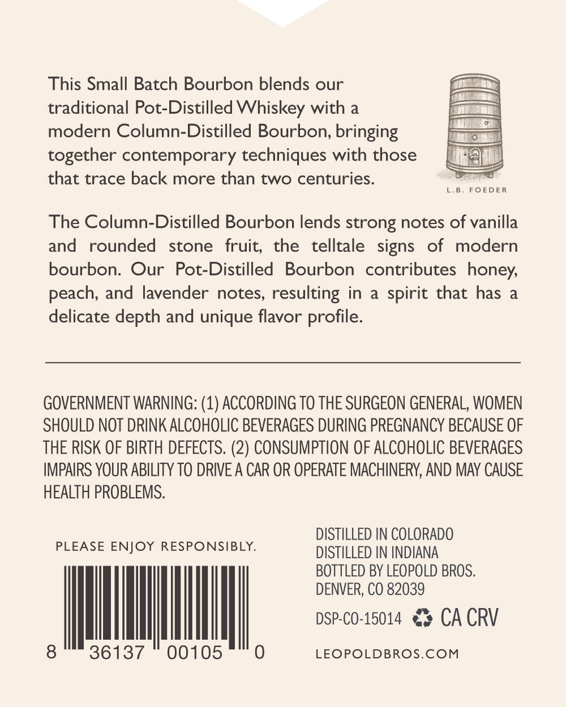
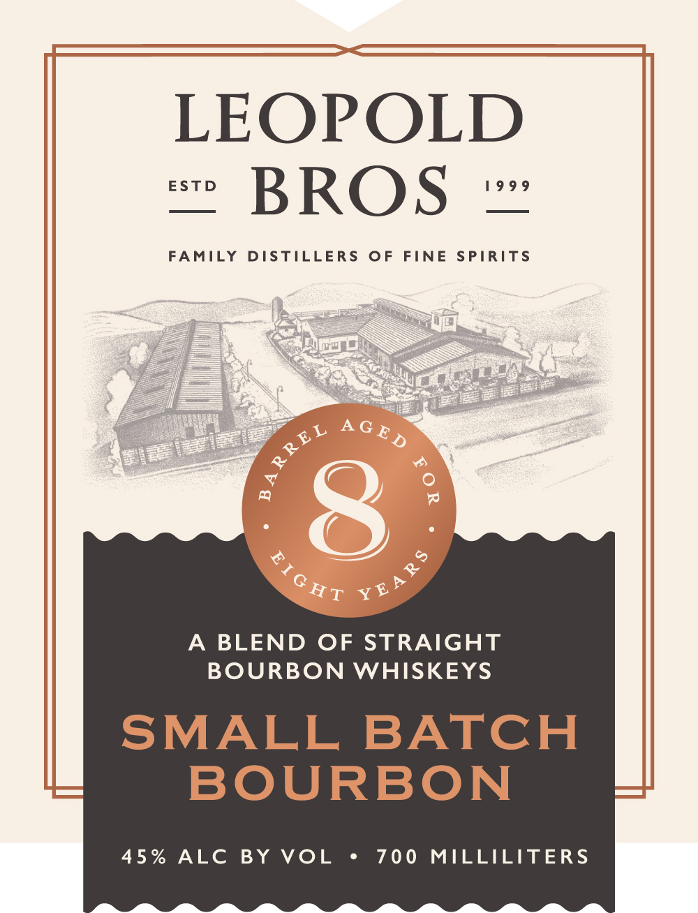

# TTB COLA Label Images - TTBID 26266001000466

**Brand Name:** LEOPOLD BROS.

**Issue Date:** 10/01/2026

**Origin Code:** 13

**Product Class/Type:** 121

**Source:** [TTB Public COLA Registry](https://ttbonline.gov/colasonline/viewColaDetails.do?action=publicFormDisplay&ttbid=26266001000466)

## Label Images

### Back Label

### Front Label

## Extracted Label Text

*Text extracted via OCR - may contain errors*

**Detected Proof:** 90

### Back Label

This Small Batch Bourbon blends our
traditional Pot-Distilled Whiskey with a
modern Column-Distilled Bourbon, bringing
together contemporary techniques with those
that trace back more than two centuries:
L.B
FOED E R
The Column-Distilled Bourbon lends strong notes of vanilla
and
rounded
stone
fruit;
the
telltale
signs
of
modern
bourbon: Our Pot-Distilled
Bourbon
contributes honey;
peach, and lavender notes, resulting in
a
spirit that has
delicate depth and unique flavor
GOVERNMENT WARNING: (1) ACCORDING TO THE SURGEON GENERAL, WOMEN
SHOULD NOT DRINK ALCOHOLIC BEVERAGES DURING PREGNANCY BECAUSE OF
THE RISK OF BIRTH DEFECTS. (2) CONSUMPTION OF ALCOHOLIC BEVERAGES
IMPAIRS YOUR ABILITY TO DRIVE A CAR OR OPERATE MACHINERY, AND MAY CAUSE
HEALTH PROBLEMS:
DISTILLED IN COLORADO
PLEASE ENJOY RESPONSIBLY:
DISTILLED IN INDIANA
BOTTLED BY LEOPOLD BROS:
DENVER; CO 82039
DSP-CO-15014
CA CRV
8
36137
00105
LEOPOLDBROS.COM
profile.

### Front Label

LEOPOLD

“ BROS

FAM

DISTILLERS OF FINE SPIRITS

A BLEND OF STRAIGHT

BOURBON WHISKEYS

SMALL BATCH

BOURBON

45% ALC BY VOL

700 MILLILITERS
