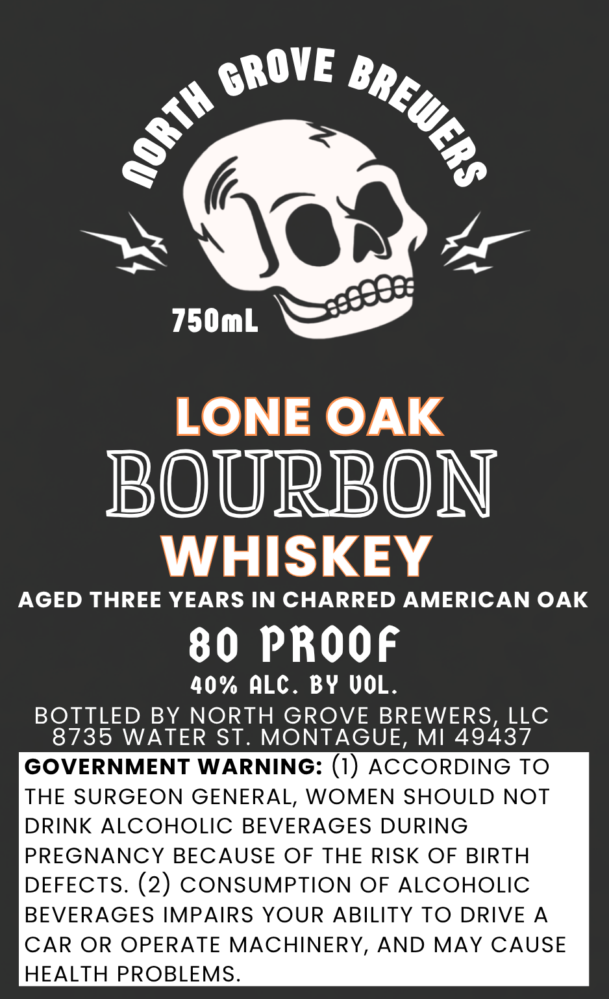

# TTB COLA Label Images - TTBID 26266001000506

**Brand Name:** NORTH GROVE BREWERS, LLC

**Fanciful Name:** LONE OAK, BOURBON WHISKEY

**Issue Date:** 09/30/2026

**Origin Code:** 06

**Product Class/Type:** 141

**Source:** [TTB Public COLA Registry](https://ttbonline.gov/colasonline/viewColaDetails.do?action=publicFormDisplay&ttbid=26266001000506)

## Label Images

### Label 1

## Extracted Label Text

*Text extracted via OCR - may contain errors*

**Detected Proof:** 80

### Label 1

750mL
LONE OAK
BOURBON
WHISKEY
AGED THREE YEARS IN CHARRED AMERICAN OAK
80 PROOf
40% ALC. BY UOL.
BOTTLED BY
NORTH GROVE BREWERS, LLC
8735 WATER ST. MONTAGUE, MI 49437
GOVERNMENT WARNING: (1)
AccORDING TO
THE SURGEON GENERAL, WOMEN SHOULD NOT
DRINK
ALCOHOLIC BEVERAGES DURING
PREGNANCY BECAUSE OF
THE RISK OF BIRTH
DEFECTS. (2) CONSUMPTION OF ALCOHOLIC
BEVERAGES IMPAIRS YOUR ABILITY
TO DRIVE A
CAR OR OPERATE MACHINERY, AND MAY CAUSE
HEALTH PROBLEMS.
GROVE
BREWERs
1
