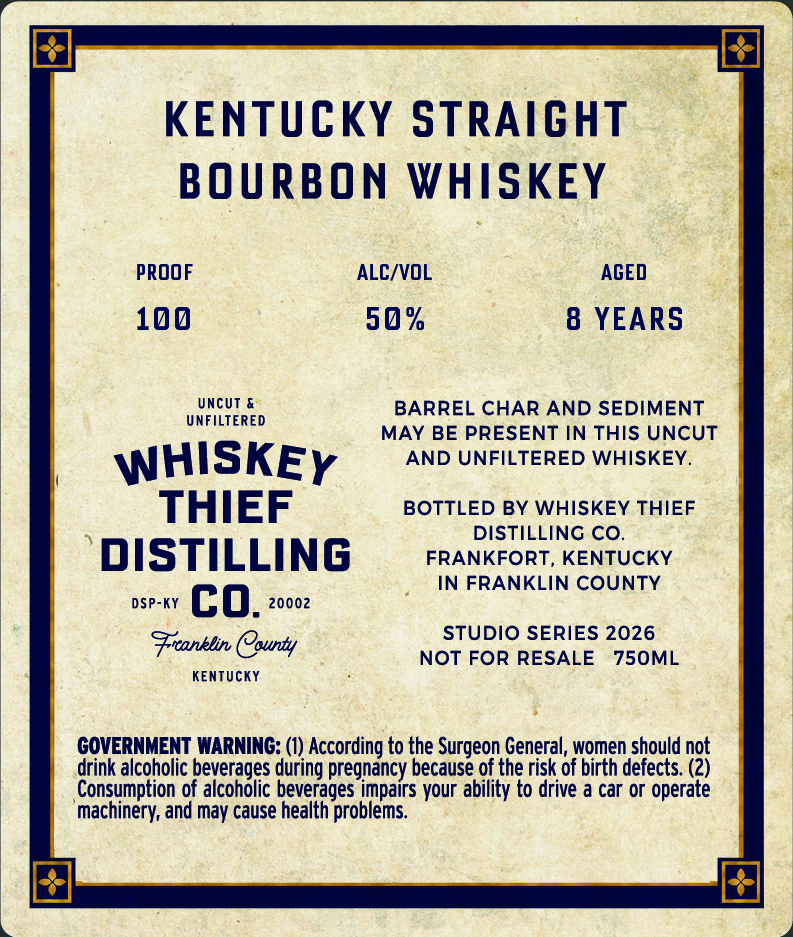
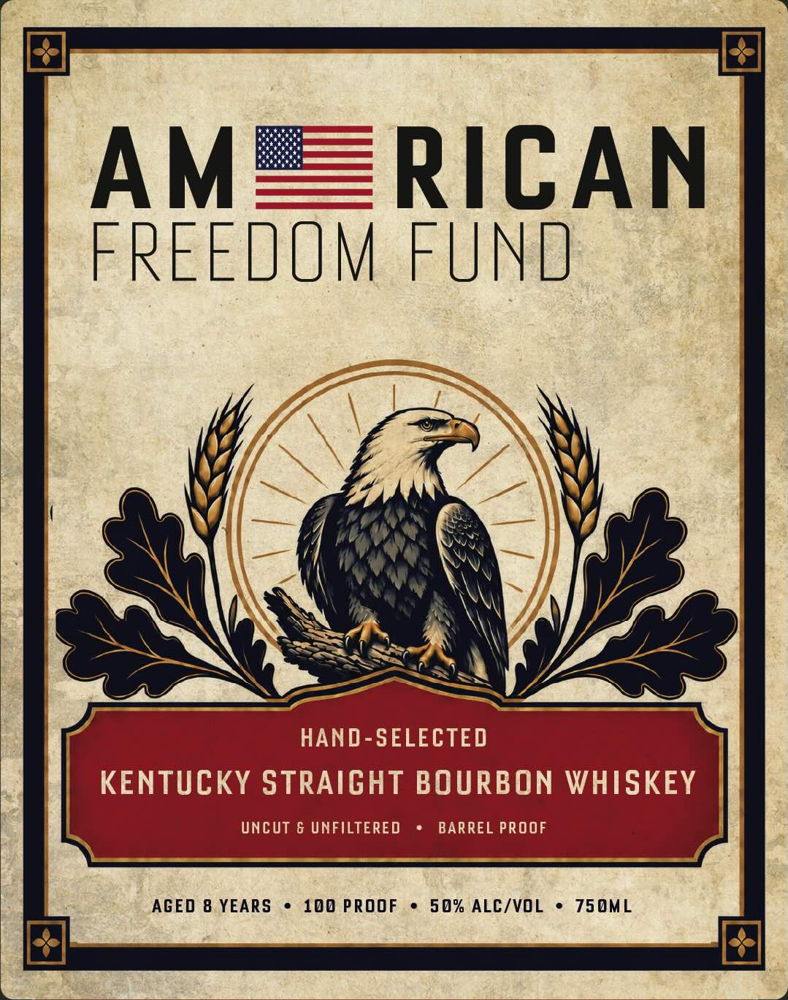
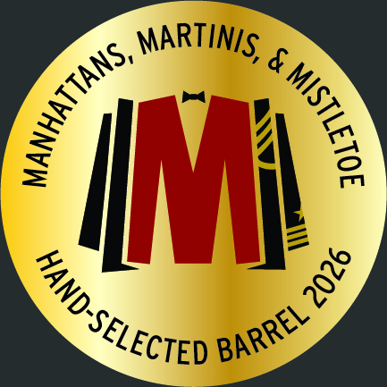

# TTB COLA Label Images - TTBID 26266001000518

**Brand Name:** WHISKEY THIEF DISTILLING CO.

**Issue Date:** 10/01/2026

**Origin Code:** 22

**Product Class/Type:** 101

**Source:** [TTB Public COLA Registry](https://ttbonline.gov/colasonline/viewColaDetails.do?action=publicFormDisplay&ttbid=26266001000518)

## Label Images

### Back Label

### Front Label

### Label 3

## Extracted Label Text

*Text extracted via OCR - may contain errors*

*1 image(s) excluded: text did not meet readability threshold*

**Detected Proof:** 100
**Detected Age:** 8 Years

### Back Label

KENTUCKY STRAiCHT
BOURBON WHISKEY
proof
ALC/VOL
AGED
100
50 %
8 YEARS
Uncut &
BARREL CHAR AND SEDIMENT
UNFILTERED
MAY BE PRESENT IN THIS UNCUT
WHISKEY
AND UNFILTERED WHISKEY
THIEF
BOTTLED BY WHISKEY THIEF
DISTILLING CO.
DISTILLING
FRANKFORT, KENTUCKY
IN FRANKLIN COUNTY
DSP-KY
co.
20002
STUDIO SERIES 2026
Fronblin County
NOT FOR RESALE
750ML
KEnTUcKY
GOVERNMENT WARNING: (1) According to the Surgeon General, women should not
drink alcoholic beverages during pregnancy because of the risk of birth defects: (2)
Consumption of alcoholic beverages impairs your ability to drive a car or operate
machinery; and may cause health problems

### Front Label

AM
RICAN
FREEDOM FUND
HAND-SELECTED
KENTUCKY STRAIGHT BOURBON WHISKEY
UncUt & UNFILTERED
BARREL PROOF
AGED 8 YEARS
100 PROOF
5 0% ALC/VOL
750ML
