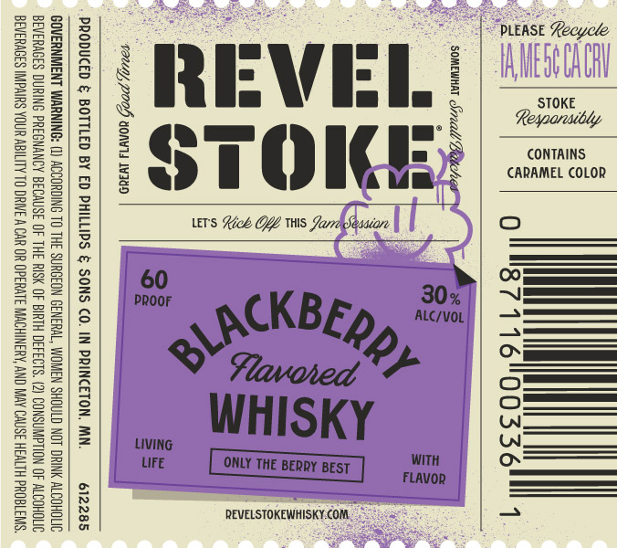

# TTB COLA Label Images - TTBID 26266001000533

**Brand Name:** REVEL STOKE

**Fanciful Name:** BLACKBERRY

**Issue Date:** 09/24/2026

**Origin Code:** 27

**Product Class/Type:** 149

**Source:** [TTB Public COLA Registry](https://ttbonline.gov/colasonline/viewColaDetails.do?action=publicFormDisplay&ttbid=26266001000533)

## Label Images

### Label 1

## Extracted Label Text

*Text extracted via OCR - may contain errors*

### Label 1

een

S38

i

22

BSs

Bas

|

PLEASE Recycle

BRE

S52

BRS

325

2o8

Bae

Ze

STOKE

S22

Be5

‘REVEL!

52

Re

SS

22

aS

Ss

5Ss

CONTAINS

225

fe

CARAMEL COLOR

sss

Sze

ae28

STO

Bez

ees

RS

ess

UTS Lick OYE Wis Jarra Seasione

Ss

Baik

Site

Bee

S25

S238

2st

60

|

PROOF

=

225

——

Ss

2s

CKBE,

——

SH=

MS

Sas

235

Mp ne

—

s=

Bas

»

Havored "PF

Sse

=

2358

S28

(2 ——_—

==

a

WHISKY

BSs

23s

LIVING

22s

LIFE

WITH

=Sk

FLAVOR

ZEE

S55

Be

S3s

==

255

REVELSTOKEWHISKY.COM.
