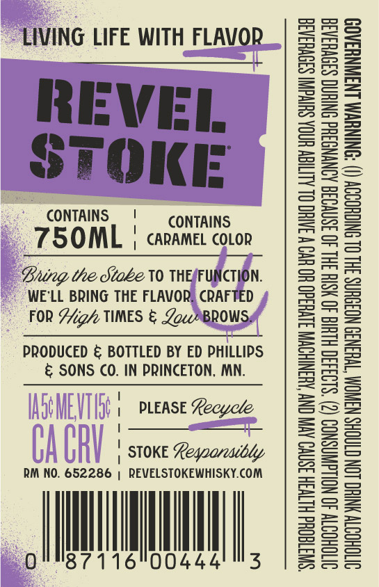
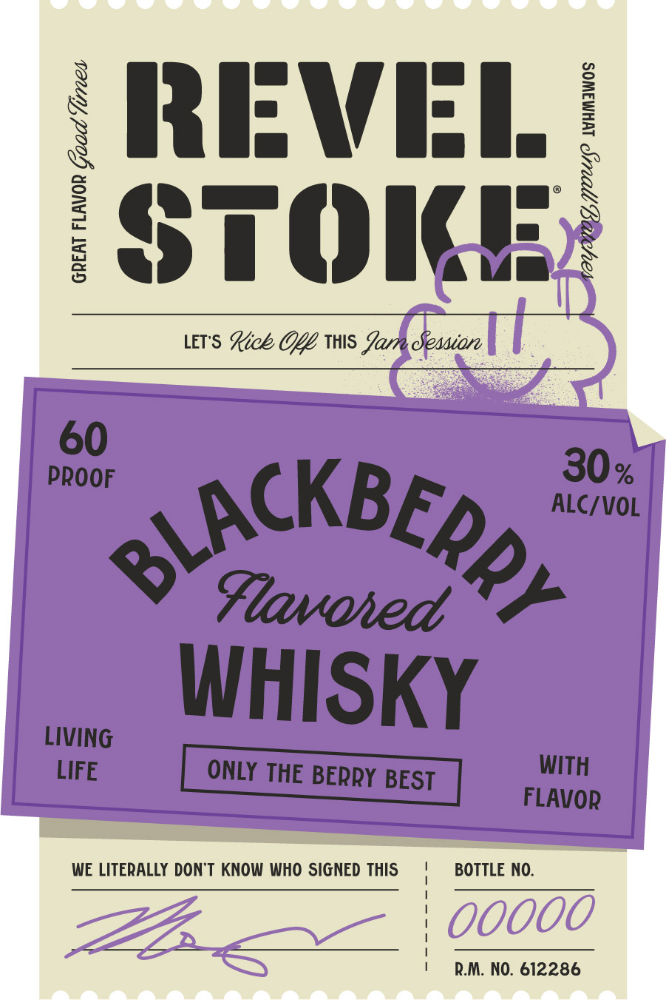

# TTB COLA Label Images - TTBID 26266001000537

**Brand Name:** REVEL STOKE

**Fanciful Name:** BLACKBERRY

**Issue Date:** 09/28/2026

**Origin Code:** 27

**Product Class/Type:** 149

**Source:** [TTB Public COLA Registry](https://ttbonline.gov/colasonline/viewColaDetails.do?action=publicFormDisplay&ttbid=26266001000537)

## Label Images

### Back Label

### Label 1

## Extracted Label Text

*Text extracted via OCR - may contain errors*

### Back Label

LIVING LIFE WITH FLAVOR

REVEL
STOKE

CONTAINS | CONTAINS

75OML | carames corr

Bung the Stabe V0 THEAFUNCTION.
WE'LL BRING THE FLAVOR, CRAFTED
FOR Aig/ TIMES & Low BROWS,

PRODUCED & BOTTLED BY ED PHILLIPS
& SONS CO. IN PRINCETON, MN.

| PLEASE Recycle
———P
| STOKE Legoarcadbdy

RM NO. 652286 | REVELSTOKEWHISKY.COM

0 th

00444'"3

“SWTGOUd HLTH 3SNVO AVI CNY AUSNIHOWN S1VHd0 HO UV W JATHC OL ALIGN HINOA SHIvdIN S3OVH3AGE
OVTOHOTTY 40 NOLLGWNSNOD (2) $193430 HLUIG 40 HSIH 3HL 40 3SNVO38 AONYNGSHd ONIHNG S39VHSA3E
VTOHOSTY YNTHC LON CTAOHS NANOM TWHSN3D NOISHNS 3HL OL SNIGHOODY () ‘ONINUWM LN3WNHAAOD

### Label 1

REVEL
STOKE

LETS Loe GGG IWS Yam Session

GREAT FLAVOR ae times

NOYMO, OU MAMAWOS

som nCKB Ep ae
Favored
> WHISKY

WE LITERALLY DON'T KNOW WHO SIGNED THIS BOTTLE NO.

R.M. NO. 612286
