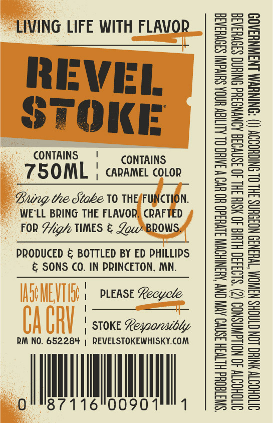
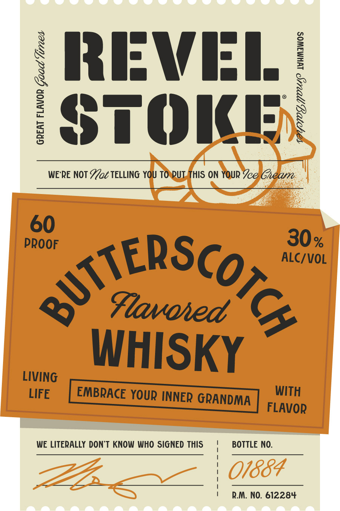

# TTB COLA Label Images - TTBID 26266001000552

**Brand Name:** REVEL STOKE

**Fanciful Name:** BUTTERSCOTCH

**Issue Date:** 09/24/2026

**Origin Code:** 27

**Product Class/Type:** 149

**Source:** [TTB Public COLA Registry](https://ttbonline.gov/colasonline/viewColaDetails.do?action=publicFormDisplay&ttbid=26266001000552)

## Label Images

### Back Label

### Label 1

## Extracted Label Text

*Text extracted via OCR - may contain errors*

**Detected Proof:** 120

### Back Label

LIVING LIFE WITH FLAVOR

REVEL
STOKE

CONTAINS. ' CONTAINS

75OML | carames covon

Bung the Stoke 10 THEFUNCTION.
WE'LL BRING THE FLAVOR, CRAFTED
FOR Sig/ TIMES & Zo ®*BROWS

PRODUCED & BOTTLED BY ED PHILLIPS
& SONS CO. IN PRINCETON, MN.

| PLEASE Recycle
:
| STOKE Leqoarewibdy

RM NO. 652284 | REVELSTOKEWHISKY.COM

orns7116"00901'" 1

“SWUTTEQHd HLTVSH ISNVO AVIV ONY AHANIHOWN SIVH3d0 HO UV W 3AIHO OL ALIEN HOA SUIVGNI S30VH3A3a
SITOHOTY 40 NOLLGWNSNOD (2) $193430 HLUIG 40 HSIH 3HL 40 3SNVO38 AONYNGSHd ONTHNG S39VH3A3
OVTOHOSTV NHC LON CTAOHS NANOM TWHIN3D NOIOUNS 3HL OL SNICHOODY () ‘ONINUWM LNSWNHSAOD

### Label 1

X RRIFWIEI /
1
STOIEt
3
WE'RE NOT Yot TELLING YOU TO PUT THIS ON YOUR Jee Gheam
60
PROOF
30 %
ALC/VOL
~StERscoee
Flavoied
WHISKY
LIVING
LIFE
EMBRACE YOUR INNER GRANDMA
WITH
FLAVOR
WE LITERALLY DONT KNOW WHO SIGNED THIS
BOTTLE NO:
01884
R.M, NO. 612284
