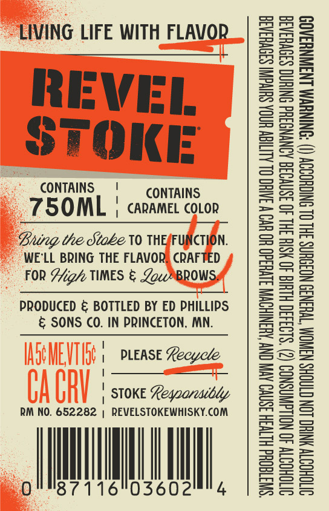
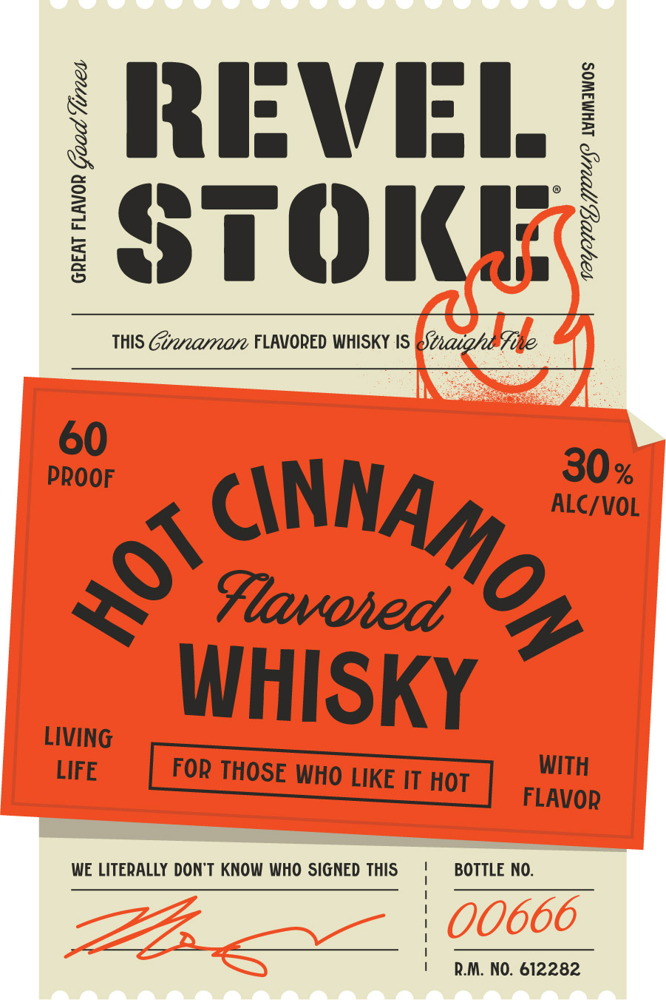

# TTB COLA Label Images - TTBID 26266001000562

**Brand Name:** REVEL STOKE

**Fanciful Name:** HOT CINNAMON

**Issue Date:** 09/24/2026

**Origin Code:** 27

**Product Class/Type:** 149

**Source:** [TTB Public COLA Registry](https://ttbonline.gov/colasonline/viewColaDetails.do?action=publicFormDisplay&ttbid=26266001000562)

## Label Images

### Back Label

### Label 1

## Extracted Label Text

*Text extracted via OCR - may contain errors*

**Detected Proof:** 120

### Back Label

LIVING LIFE WITH FLAVOR

REVEI

STOKE

CONTAINS | CONTAINS

750OML | carame covon

Bung the Stabe V0 THEFUNCTION.
WE'LL BRING THE FLAVOR) CRAFTED
FOR igh TIMES & Zoc/MBROWSy

PRODUCED & BOTTLED BY ED PHILLIPS
& SONS CO. IN PRINCETON, NIN.

| PLEASE Recycle
:
| STOKE Leqoarcaibdy

RM NO. 652282 | REVELSTOKEWHISKY.COM

0 I 16 A,

“SWTTEOQHd HLTVSH 3SNVO AVIV ONY AHANIHOWN S1VU3d0 HO UO W INH OL ALIIEW HOA SUIVGNI S39VHRA3
SITOHOTY 40 NOLLGWASNOD (2) ‘S193430 HLH 40 HSIH 3HL 40 ISNVO3G AINYNGSHd ONIHNG SS0VHSAS
SVTOHOOTY YNIHO LON CTAOHS WANOM TWHEN3S NOIOUNS 3HL OL NICHOODY () ‘ONINUWM LNSWNYSAOD

### Label 1

X RRIFWI:I /
I
STOIdE}
THIS Ginnaron FLAVORED WHISKY IS 8taighb
60
PROOF
30%
ALC/VOL
Flavoied
WHISKY
LIVING
LIFE
FoR THOSE WHO LIKE IT HOT
WITH
FLAVOR
WE LITERALLY DONT KNOW WHO SIGNED THIS
BOTTLE NO:
00666
RM. NO. 612282
AnNAMOr
2
