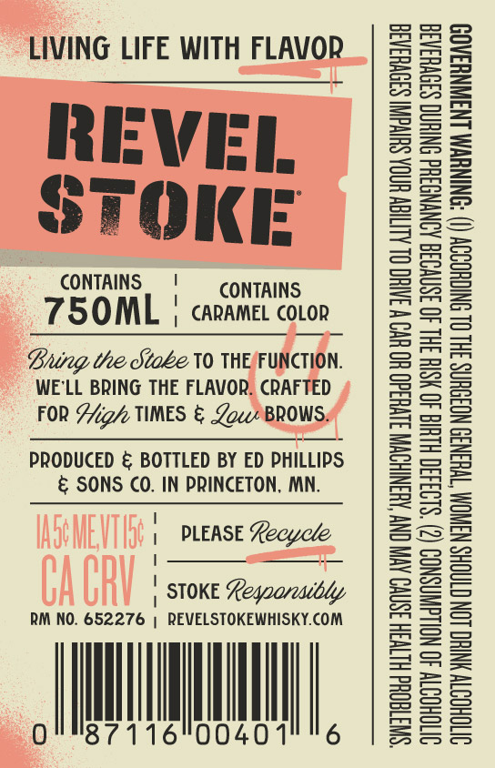
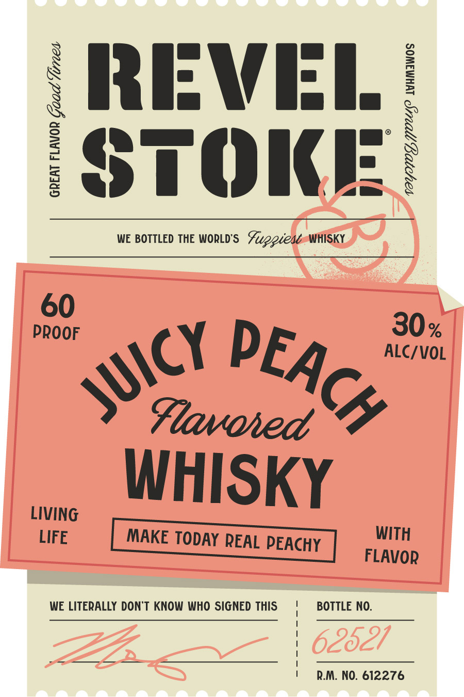

# TTB COLA Label Images - TTBID 26266001000574

**Brand Name:** REVEL STOKE

**Fanciful Name:** JUICY PEACH

**Issue Date:** 09/25/2026

**Origin Code:** 27

**Product Class/Type:** 149

**Source:** [TTB Public COLA Registry](https://ttbonline.gov/colasonline/viewColaDetails.do?action=publicFormDisplay&ttbid=26266001000574)

## Label Images

### Back Label

### Label 1

## Extracted Label Text

*Text extracted via OCR - may contain errors*

**Detected Proof:** 120

### Back Label

LIVING LIFE WITH FLAVOR

REVEL
STOKE

CONTAINS ' CONTAINS

75OML | carame covon

Bung the Stoke V0 THE/FUNCTION.
WE'LL BRING THE FLAVOR. CRAFTED
FOR Aizh TIMES & Low BROWS.

PRODUCED & BOTTLED BY ED PHILLIPS
& SONS CO. IN PRINCETON, MN.

| PLEASE Recycle
i :
| STOKE Legaareacbly

RM NO. 652276 | REVELSTOKEWHISKY.COM

Orns 7116 6

0040

“SWITTEQHd HLTVSH ISNVO AVIV ON AUSNIHOWM S1VU3d0 UO UV W INH OL ALIIGW UGA SUIVGNT S39VHaA3a
OITOHODTY 40 NOLLGWNSNOD (2) ‘$193430 HLH 40 HSIH IHL 40 3SNVO3G AONYNGSHd SNIHNG S30VHSAS
OVTOHODTY YNHO LON CTAGHS NSWNOM “T¥H3N39 NO3OUNS 3HL OL SNIGHODOY (I) “SNINUVM LNAWNYSAO9

### Label 1

{ RRIFWII /
I
STOice|
WE BOTTLED THE WORLD'S
Fuppies WHISKY
60
PROOF
30 %
ALC/VOL
Flavoied
WHISKY
LIVING
LIFE
MAKE TODAY REAL PEACHY
WITH
FLAVOR
WE LITERALLY DonT KNOW WHO SIGNED THIS
BOTTLE NO.
62621
RM. NO. 612276
PEACH
JUicY
