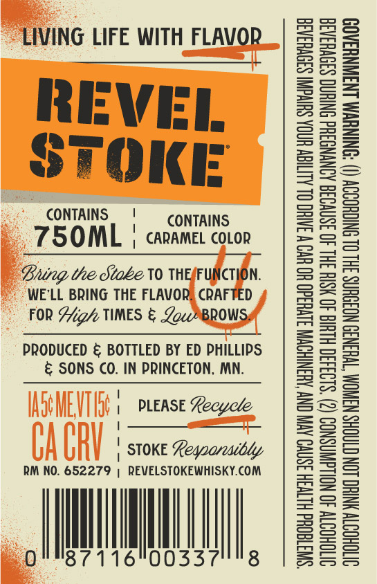
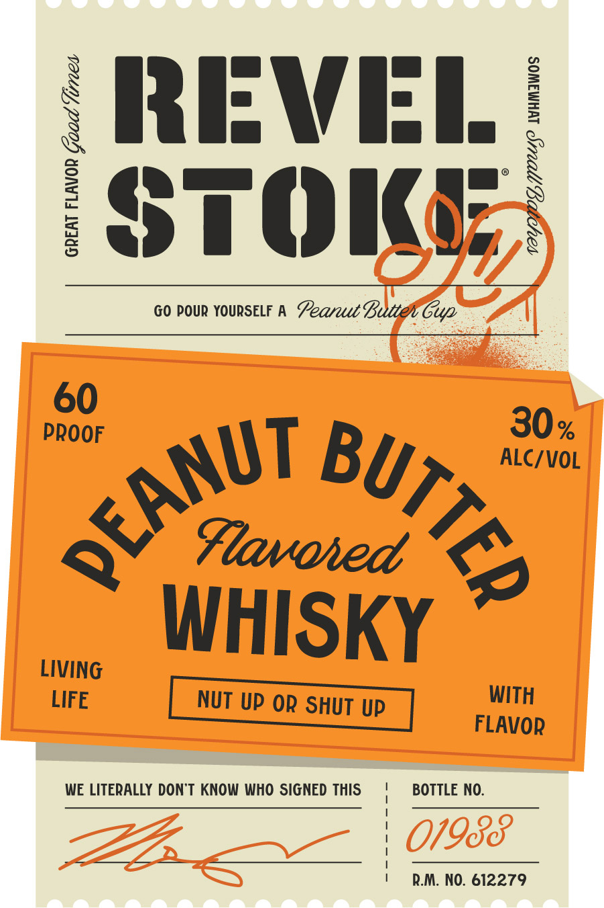

# TTB COLA Label Images - TTBID 26266001000589

**Brand Name:** REVEL STOKE

**Fanciful Name:** PEANUT BUTTER

**Issue Date:** 09/24/2026

**Origin Code:** 27

**Product Class/Type:** 149

**Source:** [TTB Public COLA Registry](https://ttbonline.gov/colasonline/viewColaDetails.do?action=publicFormDisplay&ttbid=26266001000589)

## Label Images

### Back Label

### Label 1

## Extracted Label Text

*Text extracted via OCR - may contain errors*

### Back Label

LIVING LIFE WITH FLAVOR

REVEL
STOKE

CONTAINS, | CONTAINS
75OML | caramel corr

Bung the Stabe V0 THEAFUNCTION.
WE'LL BRING THE FLAVOR) CRAFTED
FOR Sigh TIMES & Low ™BROWSy

PRODUCED & BOTTLED BY ED PHILLIPS
& SONS CO. IN PRINCETON, MN.

| PLEASE Recycle
F
| STOKE Legoarcadbdy

RM NO. 652279 | REVELSTOKEWHISKY.COM

0 Mi

00S | 8

“SWTGOUd HLTH 3SNVO AVI CNY AUSNIHOWN S1VHd0 HO UV W JATHC OL ALIGN HINOA SHIvdIN S3OVH3AGE
OVTOHOTTY 40 NOLLGWNSNOD (2) $193430 HLUIG 40 HSIH 3HL 40 3SNVO38 AONYNGSHd ONIHNG S39VHSA3E
OVTOHODTY YNHO LON CTAOHS NSWOM “TWH3N39 NO3OHNS 3HL OL SNIGHODOY (I) “ONINVM INAWNYSAO9

### Label 1

REVEL
STOKE

GO pouR YOURSELF A Seareut Buti Giya

GREAT FLAVOR Goad Vines

VOY BOD, OUUP WUMAWOS

60 30.

WUT By
PF yrnvored

LIVING Y
LIFE NUT UP OR SHUT UP aie
FLAVOR

WE LITERALLY DON'T KNOW WHO SIGNED THIS BOTTLE NO.

R.M. NO. 612279
