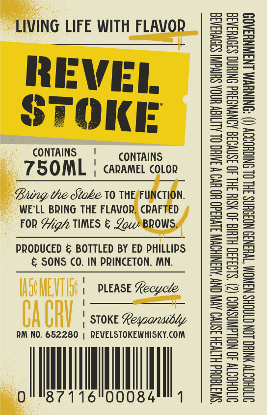
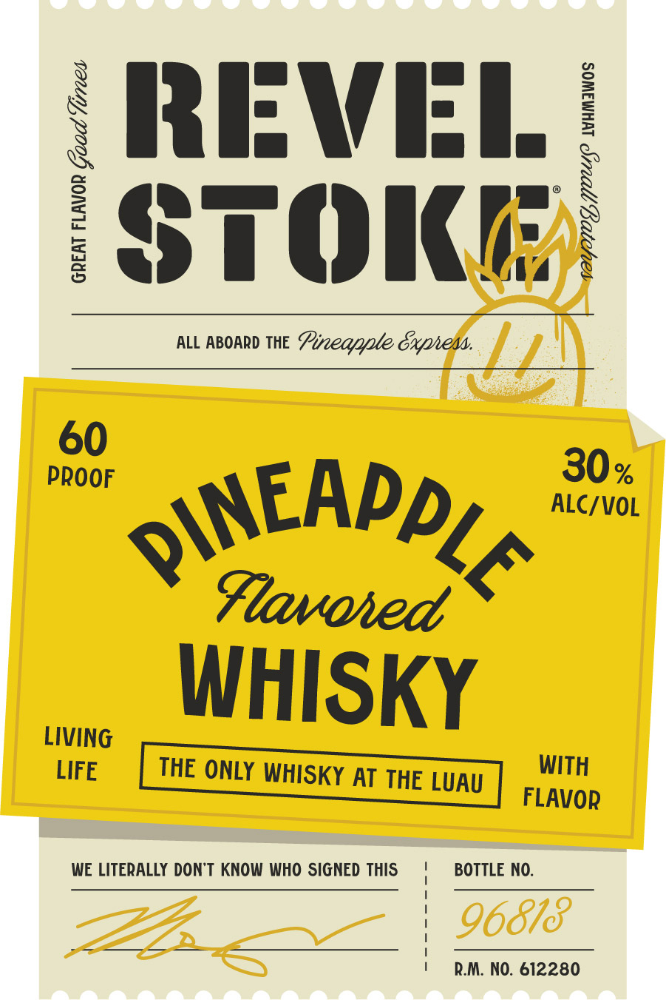

# TTB COLA Label Images - TTBID 26266001000600

**Brand Name:** REVEL STOKE

**Fanciful Name:** PINEAPPLE

**Issue Date:** 09/24/2026

**Origin Code:** 27

**Product Class/Type:** 149

**Source:** [TTB Public COLA Registry](https://ttbonline.gov/colasonline/viewColaDetails.do?action=publicFormDisplay&ttbid=26266001000600)

## Label Images

### Back Label

### Label 1

## Extracted Label Text

*Text extracted via OCR - may contain errors*

**Detected Proof:** 120

### Back Label

LIVING LIFE WITH FLAVOR

REVEL
STOKE

CONTAINS | CONTAINS

75OML | carame covon

Bung the Stoke 10 THEFUNCTION.
WE'LL BRING THE FLAVOR. CRAFTED
FOR Afz/ TIMES & ZowBROWS:

PRODUCED & BOTTLED BY ED PHILLIPS
& SONS CO. IN PRINCETON, MN.

| PLEASE Recycle
:
| STOKE Leqoarcaibdy

RM NO. 652280 | REVELSTOKEWHISKY.COM

0 I 16 HU

“SWTTEOQHd HLTVSH 3SNVO AVIV ONY AHANIHOWN S1VU3d0 HO UO W INH OL ALIIEW HOA SUIVGNI S39VHRA3
SITOHOTY 40 NOLLGWASNOD (2) ‘S193430 HLH 40 HSIH 3HL 40 ISNVO3G AINYNGSHd ONIHNG SS0VHSAS
SVTOHOOTY YNIHO LON CTAOHS WANOM TWHEN3S NOIOUNS 3HL OL NICHOODY () ‘ONINUWM LNSWNYSAOD

### Label 1

X RRIFWI:I /
$
1
3
STOKK
ALL ABOARD THE
Pineapple Gxpnem
60
PROOF
30%
ALC/VOL
QINEADDL A
Flavoied
WHISKY
LIVING
LIFE
THE ONLY WHISKY AT THE LUAU
WITH
FLAVOR
WE LITERALLY DONT KNOW WHO SIGNED THIS
BOTTLE NO:
96818
R.M. NO. 612280
