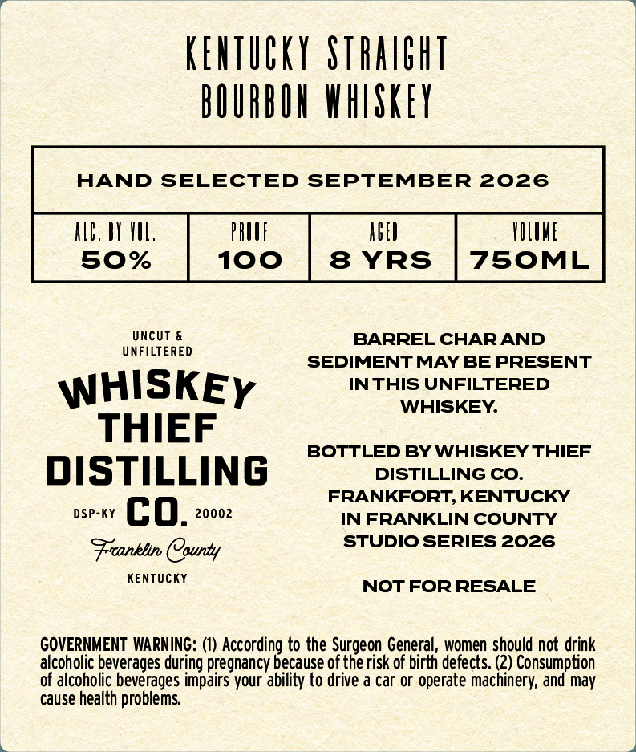

# TTB COLA Label Images - TTBID 26266001000606

**Brand Name:** WHISKEY THIEF DISTILLING CO.

**Issue Date:** 09/29/2026

**Origin Code:** 22

**Product Class/Type:** 101

**Source:** [TTB Public COLA Registry](https://ttbonline.gov/colasonline/viewColaDetails.do?action=publicFormDisplay&ttbid=26266001000606)

## Label Images

### Back Label

### Front Label

## Extracted Label Text

*Text extracted via OCR - may contain errors*

**Detected Proof:** 100
**Detected Age:** 8 Years

### Back Label

kehticky Stralbht
bOIRBOH whISkeY
HAND SELECTED SEPTEMBER 2026
ALL. bY VIL
pRUIF
AFEI
YILUHE
50%
100
8 YRS
750ML
UncUT &
BARREL CHARAND
UNFILTERED
SEDIMENT MAY BE PRESENT
WHISKEY
IN THIS UNFILTERED
WHISKEY
THIEF
BOTTLED BY WHISKEY THIEF
DISTILLING
DISTILLING CO_
FRANKFORT, KENTUCKY
DSP-KY
co.
20002
IN FRANKLIN COUNTY
STUDIO SERIES 2026
Franblin County
KenTUcKY
NOT FOR RESALE
GOVERNMENT WARNING: (1) According to the Surgeon General, women should not drink
alcoholic beverages during pregnancy because of the risk of birth defects. (2) Consumption
of alcoholic beverages impairs your ability to drive a car or operate machinery, and may
cause health problems

### Front Label

IRONCLAD
POWERED BY
OMERSINO
Falde pu
OGLOBALPUMP
8
KehTiEKy Siraibht
0
0
bOURbOH whSkeY
S
HAND SELECTED SEPTEMBER 2026
ALE; bY XUL;
PRUUF
ABEI
HULUNE
50%
100
8 YRS
75OML
1-833-ICTOUGH
IRONCLADENVIRONMENTALCOM
OMERSINO
IRONCLAd
OMersiNo
Ponlacd By[
&AtiA
5
'Ronc-
