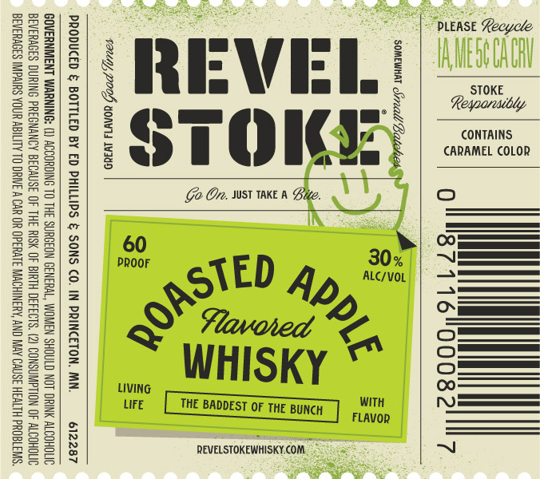

# TTB COLA Label Images - TTBID 26266001000610

**Brand Name:** REVEL STOKE

**Fanciful Name:** ROASTED APPLE

**Issue Date:** 09/24/2026

**Origin Code:** 27

**Product Class/Type:** 149

**Source:** [TTB Public COLA Registry](https://ttbonline.gov/colasonline/viewColaDetails.do?action=publicFormDisplay&ttbid=26266001000610)

## Label Images

### Label 1

## Extracted Label Text

*Text extracted via OCR - may contain errors*

### Label 1

=
R 2
& SS =e
2 | =| 0 alll
SOMEWHAT Seal Batalch ys
xy s
Ti SS 5s
= >) =
Bol west + §] |:
— | =|| §
g =| B
= 5 SIE
wy: B|| 2
| & sii) 2
C2 sm (y)
== we G zx
Tatum, POOH YONYs NID z

PRODUCED & BOTTLED BY ED PHILLIPS & SONS CO. IN PRINCETON, MIN. 612287

GOVERNMENT WARNII ) ACCORDING TO THE SURGEON GENERAL, WOMEN SHOULD NOT DRINK ALCOHOLIC
BEVERAGES DURING PREGNANCY BECAUSE OF THE RISK OF BIRTH DEFECTS. (2) CONSUMPTION OF ALCOHOLIC
BEVERAGES IMPAIRS YOUR ABILITY TO DRIVE A CAR OR OPERATE MACHINERY, AND MAY CAUSE HEALTH PROBLEMS.
