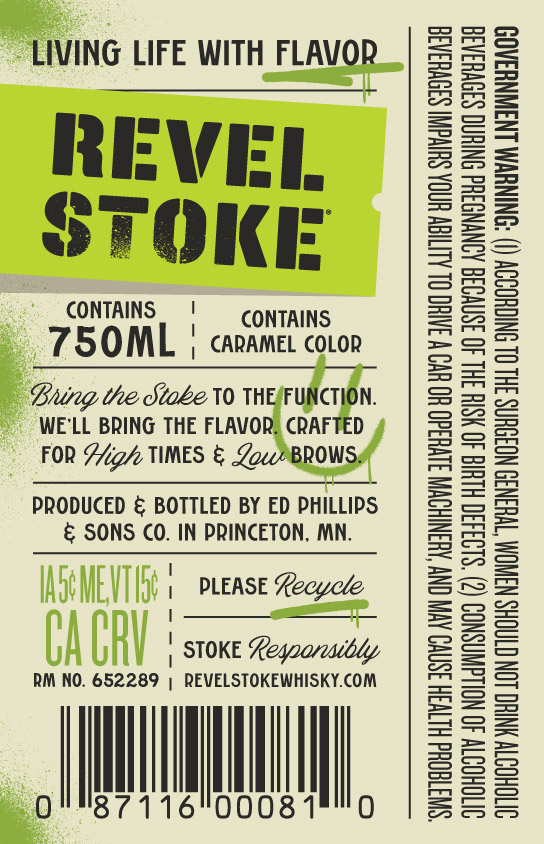
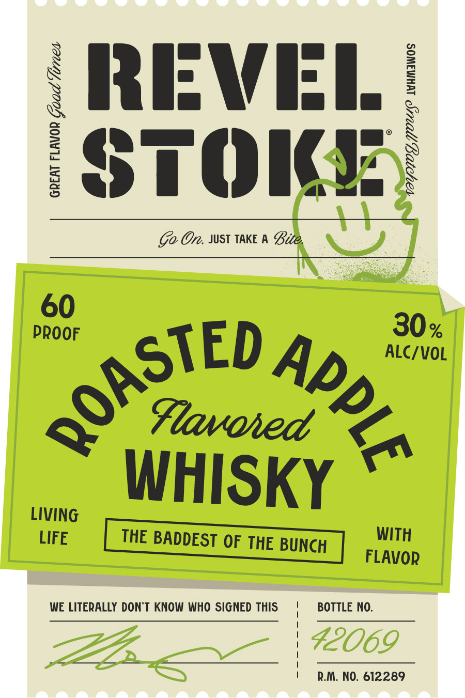

# TTB COLA Label Images - TTBID 26266001000617

**Brand Name:** REVEL STOKE

**Fanciful Name:** ROASTED APPLE

**Issue Date:** 09/24/2026

**Origin Code:** 27

**Product Class/Type:** 149

**Source:** [TTB Public COLA Registry](https://ttbonline.gov/colasonline/viewColaDetails.do?action=publicFormDisplay&ttbid=26266001000617)

## Label Images

### Back Label

### Label 1

## Extracted Label Text

*Text extracted via OCR - may contain errors*

**Detected Proof:** 120

### Back Label

LIVING LIFE WITH FLAVOR
REVEL
STOKE

CONTAINS |! CONTAINS

750OML | caramel cotor

ing the Stabe V0 THESFUNCTION.
WE'LL BRING THE FLAVOR, CRAFTED 4

FOR Hig/ TIMES & pows/,

PRODUCED & BOTTLED BY ED PHILLIPS
& SONS CO. IN PRINCETON, MN.

\ PLEASE Kecycle,
TO

i}
| it
PAPDY
AUAY I) | STOKE Regoaresibly
RM NO. ie | REVELSTOKEWHISKY.COM

87116"00081°"0

“SWITTEQHd HLTVSH ISNVO AVIV ON AUSNIHOWM S1VU3d0 UO UV W INH OL ALIIGW UGA SUIVGNT S39VHaA3a
OITOHODTY 40 NOLLGWNSNOD (2) ‘$193430 HLH 40 HSIH IHL 40 3SNVO3G AONYNGSHd SNIHNG S30VHSAS
OVTOHODTY YNHO LON CTAGHS NSWNOM “T¥H3N39 NO3OUNS 3HL OL SNIGHODOY (I) “SNINUVM LNAWNYSAO9

### Label 1

{ RRIFWII /
1
{
3
STOKI
Go On. JUST TAKE A Bite.
60
PRoOF
30 %
ALC/VOL
Flavoied
WHISKY
LIVING
LIFE
THE BADDEST OF THE BUNCH
WITH
FLAVOR
WE LITERALLY DONT KNOW WHO SIGNED THIS
BOTTLE NO.
42069
R.M: NO. 612289
QOASTED
2
