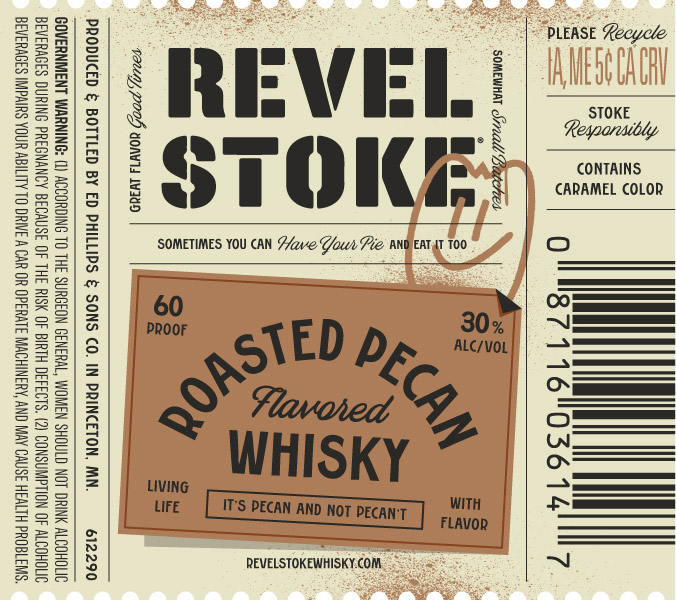

# TTB COLA Label Images - TTBID 26266001000628

**Brand Name:** REVEL STOKE

**Fanciful Name:** ROASTED PECAN

**Issue Date:** 09/24/2026

**Origin Code:** 27

**Product Class/Type:** 149

**Source:** [TTB Public COLA Registry](https://ttbonline.gov/colasonline/viewColaDetails.do?action=publicFormDisplay&ttbid=26266001000628)

## Label Images

### Label 1

## Extracted Label Text

*Text extracted via OCR - may contain errors*

### Label 1

STOKE
CONTAINS.
CARAMEL COLOR

PLEASE Recycle

!

SOMEWHAT &Si7eall Beaperres.

|
ALC/VOL

De
&
ZB

VEL
STOKE

WHISKY

IT'S PECAN AND NOT PECANT
REVELSTOKEWHISKY.COM.

TED
9
=

SOMETIMES YOU CAN F/ave Gout Pie ANOEAT AT 100

60
PRoor

Tauly, POOH sons W389

PRODUCED & BOTTLED BY ED PHILLIPS & SONS CO. IN PRINCETON, MN. 612290

GOVERNMENT WARNI ) ACCORDING TO THE SURGEON GENERAL, WOMEN SHOULD NOT DRINK ALCOHOLIC
BEVERAGES DURING PREGNANCY BECAUSE OF THE RISK OF BIRTH DEFECTS. (2) CONSUMPTION OF ALCOHOLIC
BEVERAGES IMPAIRS YOUR ABILITY TO DRIVE A CAR OR OPERATE MACHINERY, AND MAY CAUSE HEALTH PROBLEMS.
