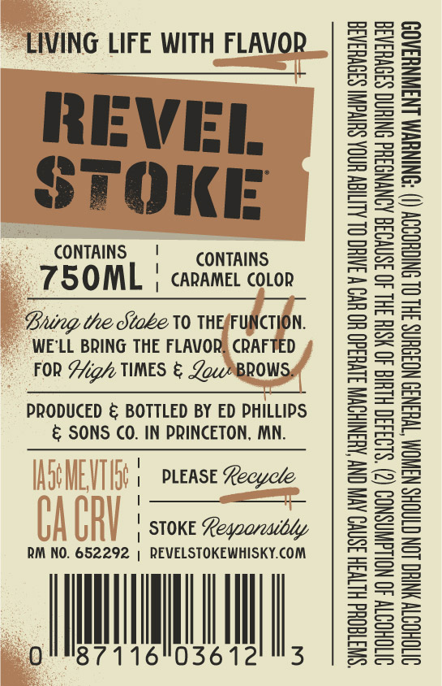
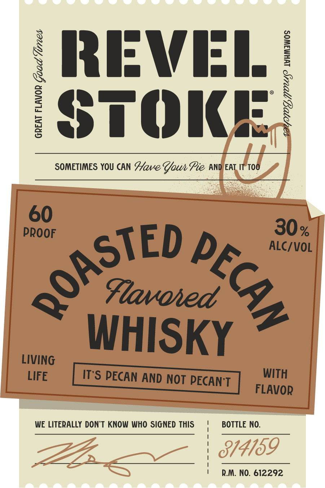

# TTB COLA Label Images - TTBID 26266001000631

**Brand Name:** REVEL STOKE

**Fanciful Name:** ROASTED PECAN

**Issue Date:** 09/24/2026

**Origin Code:** 27

**Product Class/Type:** 149

**Source:** [TTB Public COLA Registry](https://ttbonline.gov/colasonline/viewColaDetails.do?action=publicFormDisplay&ttbid=26266001000631)

## Label Images

### Back Label

### Label 1

## Extracted Label Text

*Text extracted via OCR - may contain errors*

**Detected Proof:** 120

### Back Label

LIVING LIFE WITH FLAVOR

REVEL
STOKE

CONTAINS, ' CONTAINS

750ML | caramel coLon

Bung the Stoke 10 THEFUNCTION.
WE'LL BRING THE FLAVOR, CRAFTED
FOR Aig TIMES & ZowPBROWS:

PRODUCED & BOTTLED BY ED PHILLIPS
& SONS CO. IN PRINCETON, MN.

| PLEASE Recycle
"
| STOKE Leqoarewibdy

RM NO. 652292 | REVELSTOKEWHISKY.COM

0 Mi ll,

036

“SWUTTEQHd HLTVSH ISNVO AVIV ONY AHANIHOWN SIVH3d0 HO UV W 3AIHO OL ALIEN HOA SUIVGNI S30VH3A3a
OVTOHOT 40 NOUdWASNOD (2) ‘S103430 HLUIG 40 NSIH 3HL 40 3SNVO36 AONYNO3Hd ONIUNG S3OVHSASA
OVTOHOSTV NHC LON CTAOHS NANOM TWHIN3D NOIOUNS 3HL OL SNICHOODY () ‘ONINUWM LNSWNHSAOD

### Label 1

X RRIFWIEI /
$
1
3
STOKE:
SOMETIMES YOU CAN Have ZouPie AND EAT IT Too
60
PROOF
30 %
ALC/VOL
Flavoied
WHISKY
LIVING
LIFE
Its PECAN ANd NOT PECANT
WITH
FLAVOR
WE LITERALLY DONT KNOW WHO SIGNED THIS
BOTTLE NO:
814769
R.M, NO. 612292
QOASTED
8
