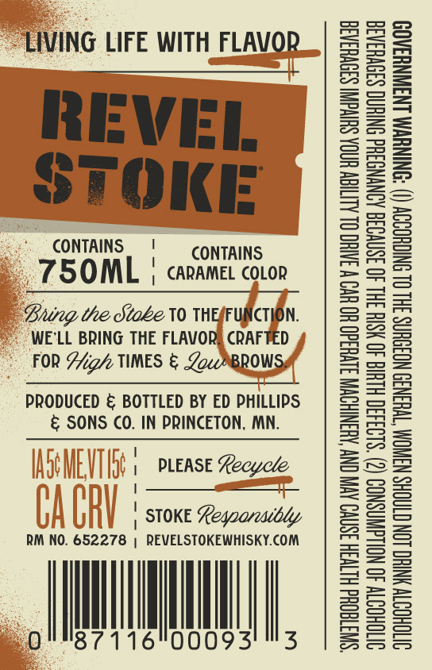
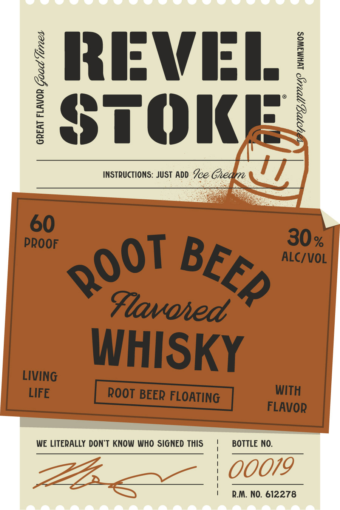

# TTB COLA Label Images - TTBID 26266001000637

**Brand Name:** REVEL STOKE

**Fanciful Name:** ROOT BEER

**Issue Date:** 09/24/2026

**Origin Code:** 27

**Product Class/Type:** 149

**Source:** [TTB Public COLA Registry](https://ttbonline.gov/colasonline/viewColaDetails.do?action=publicFormDisplay&ttbid=26266001000637)

## Label Images

### Back Label

### Label 1

## Extracted Label Text

*Text extracted via OCR - may contain errors*

### Back Label

“LIVING LIFE WITH_FLAVO! LIFE WITH FLAVOR
REVEL EVEL.
oF :
STOKE

CONTAINS | CONTAINS

_TSOML | cavanes coon

Bung the Stoke V0 THEFUNCTIN.
© WE'LL BRING THE FLAVOR§ CRAFTED
FOR Hig’ TIMES & ZoceMBROWSS

PRODUCED & BOTTLED BY ED PHILLIPS

& SONS CO. IN PRINCETON, MN.

[Fe ' PLEASE Kecycle
1
| STOKE Legoareadbly

RM NO. 652278 i REVELSTOKEWHISKY.COM

87116°00093' "3

OITOHODTY 40 NOLLGWNSNOD (2) ‘$193430 HLH 40 HSIH IHL 40 3SNVO3G AONYNGSHd SNIHNG S30VHSAS
OVTOHODTY YNHO LON CTAGHS NSWNOM “T¥H3N39 NO3OUNS 3HL OL SNIGHODOY (I) “SNINUVM LNAWNYSAO9

“SWITTEQHd HLTVSH ISNVO AVIV ON AUSNIHOWM S1VU3d0 UO UV W INH OL ALIIGW UGA SUIVGNT S39VHaA3a

### Label 1

REVEL
STOKE

INSTRUCTIONS: JUST ADD Ze Gheaye

GREAT FLAVOR Goad Vines

BY 210, OU? MHMAWOS

LIVING Y
LIFE ROOT BEER FLOA abe
TING FLAVOR

WE LITERALLY DON'T KNOW WHO SIGNED THIS

BOTTLE NO.

R.M. NO. 612278
