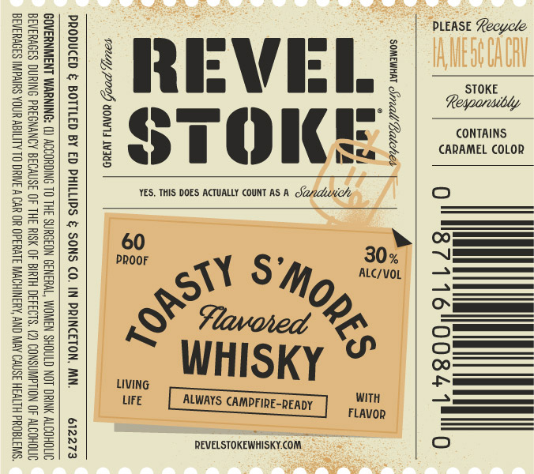

# TTB COLA Label Images - TTBID 26266001000644

**Brand Name:** REVEL STOKE

**Fanciful Name:** TOASTY S'MORES

**Issue Date:** 09/25/2026

**Origin Code:** 27

**Product Class/Type:** 149

**Source:** [TTB Public COLA Registry](https://ttbonline.gov/colasonline/viewColaDetails.do?action=publicFormDisplay&ttbid=26266001000644)

## Label Images

### Label 1

## Extracted Label Text

*Text extracted via OCR - may contain errors*

### Label 1

= =
85 g
i= ws 2s
Va /S8 |e
a= | =| 0) ADH)
SOMEWHAT Sreadl Batches
Bead =:
a ay *
rie) ; | i
— 3 NS li]
a 5] 8
3 '2
o.8 Z je} 3
= g 2
a ot J, Oe
EZ wos * gy
55
Tam, POOS YONWs INID i

PRODUCED & BOTTLED BY ED PHILLIPS & SONS CO. IN PRINCETON, MN. 612273

GOVERNMENT WARNII ) ACCORDING TO THE SURGEON GENERAL, WOMEN SHOULD NOT DRINK ALCOHOLIC
BEVERAGES DURING PREGNANCY BECAUSE OF THE RISK OF BIRTH DEFECTS. (2) CONSUMPTION OF ALCOHOLIC
BEVERAGES IMPAIRS YOUR ABILITY TO DRIVE A CAR OR OPERATE MACHINERY, AND MAY CAUSE HEALTH PROBLEMS.
