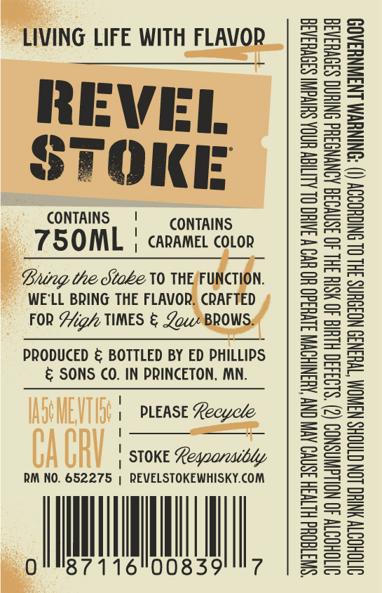
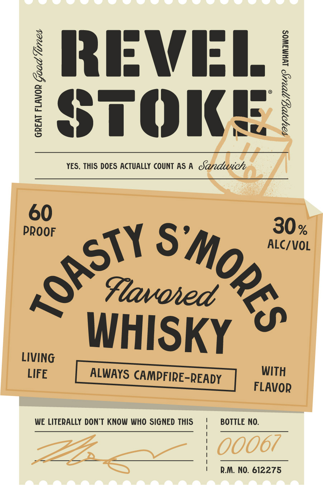

# TTB COLA Label Images - TTBID 26266001000647

**Brand Name:** REVEL STOKE

**Fanciful Name:** TOASTY S'MORES

**Issue Date:** 09/24/2026

**Origin Code:** 27

**Product Class/Type:** 149

**Source:** [TTB Public COLA Registry](https://ttbonline.gov/colasonline/viewColaDetails.do?action=publicFormDisplay&ttbid=26266001000647)

## Label Images

### Back Label

### Label 1

## Extracted Label Text

*Text extracted via OCR - may contain errors*

### Back Label

op
LIVING LIFE WITH G LIFE WITH FLAP

CONTAINS | CONTAINS

750OML | caramel covor
fe THE/FUNCTION.
WE'LL BRING THE FLAVOR. CRAFTED
FOR High TIMES & Zou BROW:

PRODUCED & BOTTLED BY ED PHILLIPS
& SONS CO. IN PRINCETON, MN.

WO MEVIG 1 PLease Reeyece

CACRY : SOK ean

RM NO. 652275 | REVELSTOKEWHISKY.COM

“SWTGOUd HLTH 3SNVO AVI CNY AUSNIHOWN S1VHd0 HO UV W JATHC OL ALIGN HINOA SHIvdIN S3OVH3AGE

OVTOHOTTY 40 NOLLGWNSNOD (2) $193430 HLUIG 40 HSIH 3HL 40 3SNVO38 AONYNGSHd ONIHNG S39VHSA3E
VTOHOSTY YNTHC LON CTAOHS NANOM TWHSN3D NOISHNS 3HL OL SNIGHOODY () ‘ONINUWM LN3WNHAAOD

### Label 1

REVEL
SFOKE

YES, THIS DOES ACTUALLY COUNT ASA Saedliwc/e

GREAT FLAVOR Goad Vines

VOYHIOY OU? MAMaWwOs

Ast 30
o\ Yo Oe, ALC/VOL
LIVING IHisKy ©
LIFE ALWAYS CAMPFIRE- WITH
READY |  FLavop

WE LITERALLY DON'T KNOW WHO SIGNED THIS BOTTLE NO.

R.M. NO. 612275
