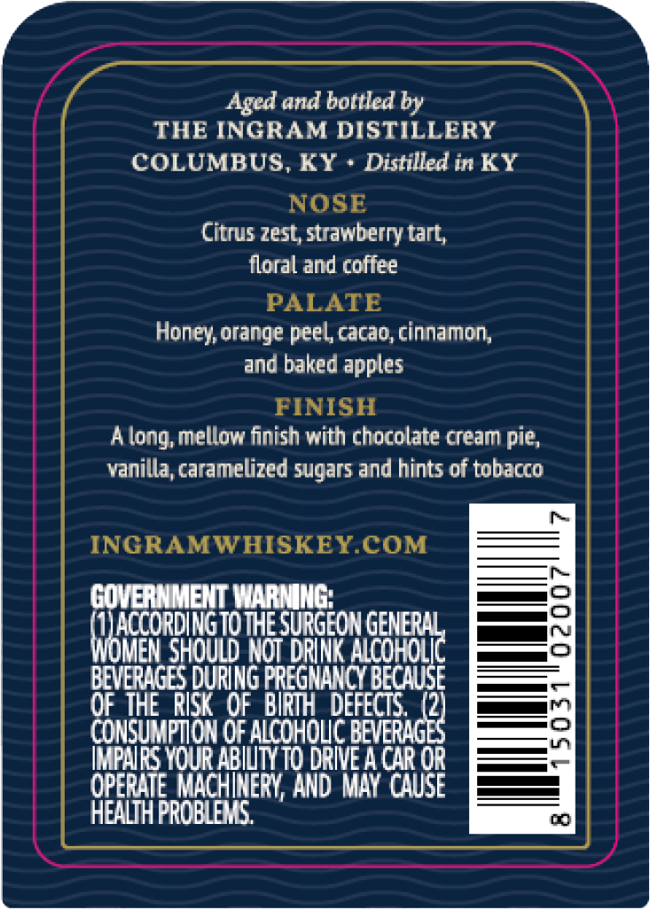
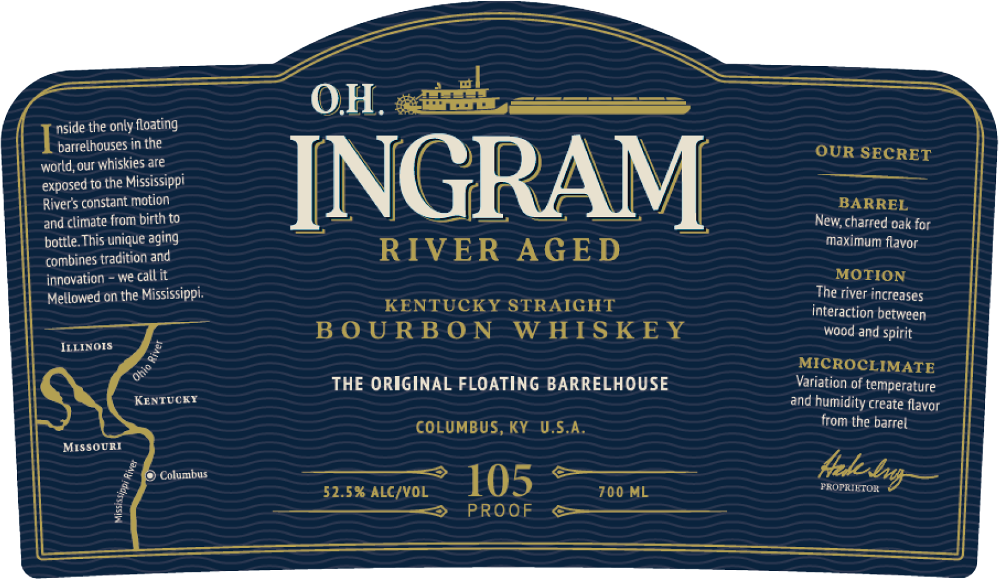
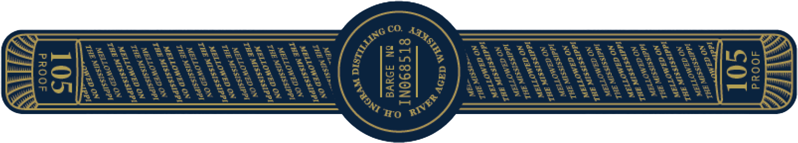

# TTB COLA Label Images - TTBID 26266001000740

**Brand Name:** O.H. INGRAM

**Issue Date:** 09/29/2026

**Origin Code:** 22

**Product Class/Type:** 101

**Source:** [TTB Public COLA Registry](https://ttbonline.gov/colasonline/viewColaDetails.do?action=publicFormDisplay&ttbid=26266001000740)

## Label Images

### Back Label

### Front Label

### Label 3

### Label 4

## Extracted Label Text

*Text extracted via OCR - may contain errors*

*1 image(s) excluded: text did not meet readability threshold*

**Detected Proof:** 105

### Back Label

Aged and bottled by
THE INGRAM DISTILLERY
COLUMBUS, KY
Distilled in KY
NOSE
Citrus zest, strawberry tart;
floral and coflee
PALATE
Honey orange peel cacao,cinnamon,
and baked apples
FINISH
A
mellow finish with chocolate cream pie,
vanilla, caramelized sugars and hints of tobacco
INGRAMWHISKEXCOM
GOVERNMENT WARMING:
MTAccordingTo ThE SuRgeON
XGEeBH
WoMen should Not DRINK
BEVERAGES DURING FREGMAWNCY BECAUSE
OF THE RISK'OF BIRMH  DEFECTS (2)
CONSuMPTON OF ALcQHoc BeveRAGB
IPARS Your ABIVTY TO DRIVE A chr or
OPERLTE MAcHIERY AND MAY  cAuse
HEALTH PRORLES
long; '

### Front Label

OH. <#3
nside the only floating
barrelhouses in the
OUR SECRET
world,our whiskies are
to the Mississippi
INGRAM
Rivers constant motion
BARREL
and climate from birth to
charred oak
bottle This unique aging
maximum flavor
combines tradition and
RIVER
AGE D
irnovation
we callit
MOTION
Mellowed on the Mississippi:
The river increases
KENTUCKY STRAIGHT
interaction between
B 0 U RB 0 N
W HIS KE Y
wood and spirit
JLLINOIS
MICROCLIMATE
THE ORIGINAL FLOATING BARRELHOUSE
Variation of temperature
KENTUCKT
and
humidity create flavor
COLUMBUS, KY
U.S.A.
from the barrel
MISSouRI
Columbus
105
PROPRELTOR
52.5% ALC/VOL
700 ML
PROOF
exposed
Ner;
for
0
Ohio
tzh bm)
1

### Label 3

MELLOWED
0 N
TIE
MIS SIS SIP PI
