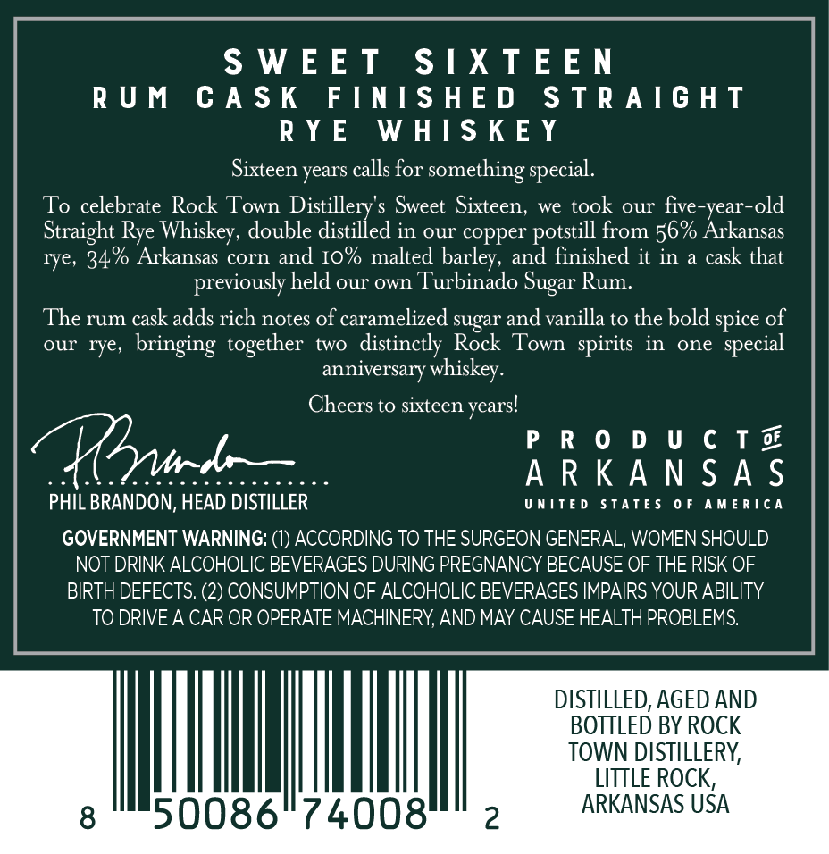
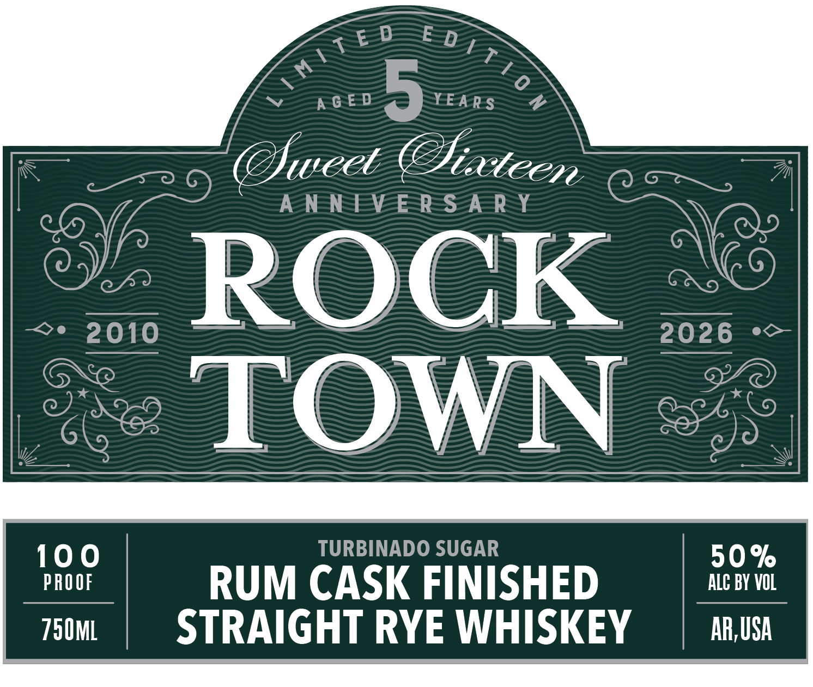

# TTB COLA Label Images - TTBID 26266001000780

**Brand Name:** ROCK TOWN

**Fanciful Name:** SWEET SIXTEEN

**Issue Date:** 09/25/2026

**Origin Code:** 12

**Product Class/Type:** 102

**Source:** [TTB Public COLA Registry](https://ttbonline.gov/colasonline/viewColaDetails.do?action=publicFormDisplay&ttbid=26266001000780)

## Label Images

### Back Label

### Front Label

## Extracted Label Text

*Text extracted via OCR - may contain errors*

### Back Label

SWEET SIXTEEN

RUM CASK FINISHED STRAIGHT

RYE WHISKEY

Sixteen years calls for something special.

To celebrate Rock Town Distillery’s Sweet Sixteen, we took our five-year-old

Straight Rye Whiskey, double distilled in our copper potstill from 56% Arkansas

rye, 34.% Arkansas corn and 10% malted barley, and finished it in a cask that

previously held our own Turbinado Sugar Rum.

The rum cask adds rich notes of caramelized sugar and vanilla to the bold spice of

our rye, bringing together two distinctly Rock Town spirits in one special

anniversary whiskey.

Cheers to sixteen years!

PRODUCT

collhboActcocddcccc0c0ce

ARKANSAS

UNITED STATES OF AMERICA

PHIL BRANDON, HEAD DISTILLER

GOVERNMENT WARNING: (1) ACCORDING TO THE SURGEON GENERAL, WOMEN SHOULD

NOT DRINK ALCOHOLIC BEVERAGES DURING PREGNANCY BECAUSE OF THE RISK OF

BIRTH DEFECTS. (2) CONSUMPTION OF ALCOHOLIC BEVERAGES IMPAIRS YOUR ABILITY

TO DRIVE A CAR OR OPERATE MACHINERY, AND MAY CAUSE HEALTH PROBLEMS.

DISTILLED, AGED AND

BOTTLED BY ROCK

TOWN DISTILLERY,

LITTLE ROCK,

50086° 74008

ARKANSAS USA

### Front Label

~

AS

<eD SZ

7

2 A-G-E-D

YEARS

Swed Six

A-N-N-EVEE-R-S-A-R-Y

Le

me %

== owe ——$—=

ROCK

== 2028 *

lo

Se TOWN =

TURBINADO SUGAR

a

RUM CASK FINISHED

kh BY inl

750ML

STRAIGHT RYE WHISKEY

AR,USA
