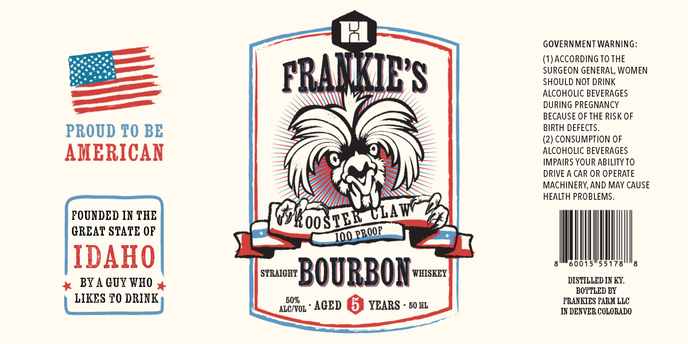

# TTB COLA Label Images - TTBID 26266001000788

**Brand Name:** FRANKIE'S ROOSTER CLAW

**Issue Date:** 09/28/2026

**Origin Code:** 13

**Product Class/Type:** 101

**Source:** [TTB Public COLA Registry](https://ttbonline.gov/colasonline/viewColaDetails.do?action=publicFormDisplay&ttbid=26266001000788)

## Label Images

### Label 1

## Extracted Label Text

*Text extracted via OCR - may contain errors*

### Label 1

GOVERNMENT WARNING:
(I)ACCORDING TO THE
PRAWIES
SURGEON GENERAL; WOMEN
SHOULD NOT DRINK
ALCOHOLIC BEVERAGES
DURING PREGNANCY
BECAUSE OF THE RISK OF
PROUD TO BE
BIRTH DEFECTS.
(2) CONSUMPTION OF
AMERICAN
ALCOHOLIC BEVERAGES
IMPAIRS YOUR ABILITY TO
DRIVE A CAR OR OPERATE
MACHINERY,AND MAY CAUSE
HEALTH PROBLEMS.
FOUNDED IN THB
LAw
GREAT STATE OF
KoosTER
700
IDAHO
8
60015
55178
8
BY A CUY WHO
STRAICHT
BOURBON
WHISKEY
DISTILLED IN KY:
BOTTLED BY
LIKES TO DRINK
505
FRANKIES FARM LLC
ALCVOL
AGED
YEARS
60 IIL
IN DENVER COLORADO
PROOP
