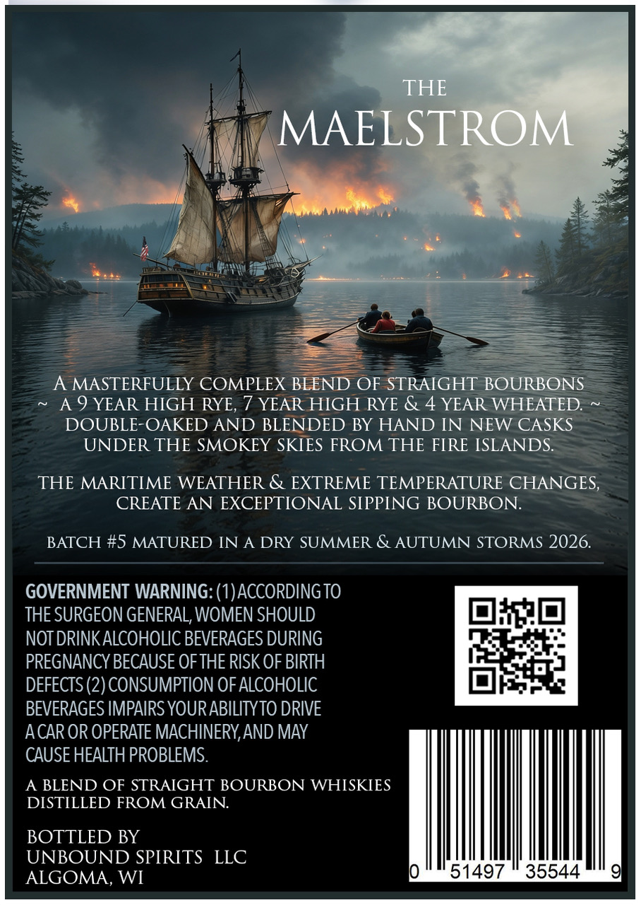
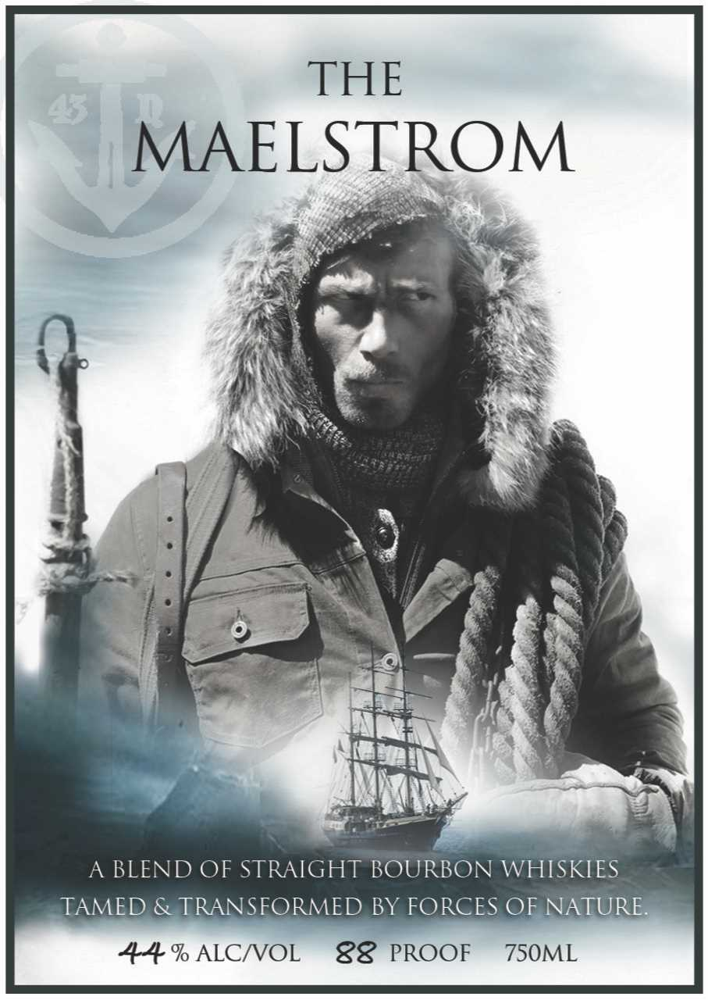

# TTB COLA Label Images - TTBID 26266001000840

**Brand Name:** THE MAELSTROM

**Issue Date:** 10/06/2026

**Origin Code:** 48

**Product Class/Type:** 121

**Source:** [TTB Public COLA Registry](https://ttbonline.gov/colasonline/viewColaDetails.do?action=publicFormDisplay&ttbid=26266001000840)

## Label Images

### Back Label

### Front Label

## Extracted Label Text

*Text extracted via OCR - may contain errors*

**Detected Proof:** 88
**Detected Age:** 9 Years

### Back Label

THE
MAELSTROM
A MASTERFULLY COMPLEX BLEND OF STRAIGHT BOURBONS
A 9 YEAR HIGH RYE, 7 YEAR HIGH RYE & 4 YEAR WHEATED:
DOUBLE-OAKED AND BLENDED BY HAND IN NEW CASKS
UNDER THE SMOKEY SKIES FROM THE FIRE ISLANDS:
THE MARITIME WEATHER & EXTREME TEMPERATURE CHANGES,
CREATE AN EXCEPTIONAL SIPPING BOURBON:
BATCH #5 MATURED IN
A DRY SUMMER & AUTUMN STORMS 2026.
GOVERNMENT WARNING: (1)ACCORDING TO
THE SURGEON GENERAL, WOMEN SHOULD
NOT DRINKALCOHOLIC BEVERAGES DURING
PREGNANCY BECAUSE OFTHE RISK OF BIRTH
DEFECTS (2) CONSUMPTION OF ALCOHOLIC
BEVERAGES IMPAIRS YOURABILITYTO DRIVE
ACAR OR OPERATE MACHINERYAND MAY
CAUSE HEALTH PROBLEMS
A BLEND OF STRAIGHT BOURBON WHISKIES
DISTILLED FROM GRAIN
BOTTLED BY
UNBOUND SPIRITS
LLC
ALGOMA, WI
51497
35544

### Front Label

THE
MAELSTROM
A BLEND OF STRAIGHT BOURBON WHISKIES
TAMED & TRANSFORMED BY FORCES OF NATURE
44 % ALCNOL
88
PROOF
7S0ML
