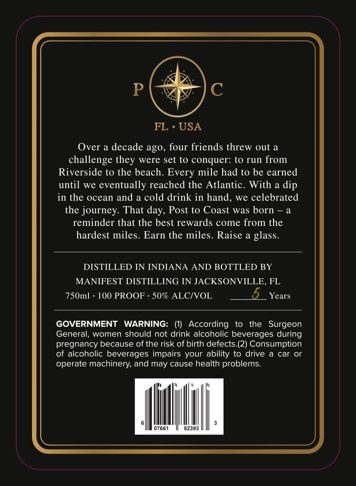
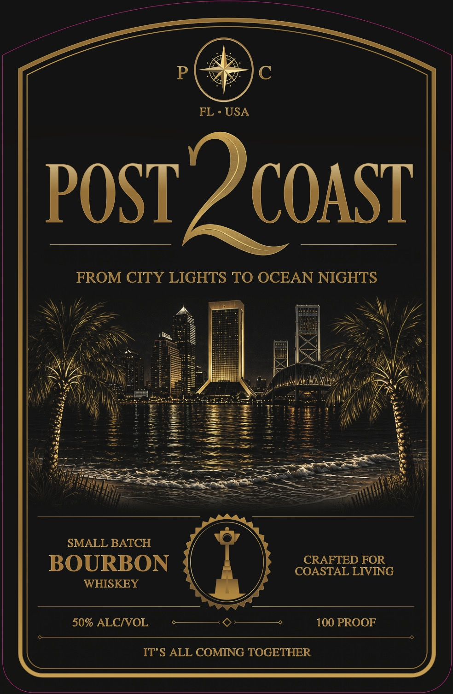

# TTB COLA Label Images - TTBID 26267001000086

**Brand Name:** POST 2 COAST

**Issue Date:** 10/05/2026

**Origin Code:** 16

**Product Class/Type:** 141

**Source:** [TTB Public COLA Registry](https://ttbonline.gov/colasonline/viewColaDetails.do?action=publicFormDisplay&ttbid=26267001000086)

## Label Images

### Back Label

### Front Label

## Extracted Label Text

*Text extracted via OCR - may contain errors*

**Detected Proof:** 100
**Detected Age:** 5 Years

### Back Label

P
FL
USA
Over a decade ago, four friends threw out a
challenge
were set to conquer: t0 run from
Riverside to the beach: Every mile had to be earned
until we eventually reached the Atlantic.
With a dip
in the ocean and
a cold drink in hand, we celebrated
the journey: That day, Post to Coast was born - a
reminder that the best rewards come from the
hardest miles
Earn the miles__
Raise
glass
DISTILLED IN INDIANA AND BOTTLED BY
MANIFEST DISTILLING IN JACKSONVILLE, FL
750ml
100 PROOF
50% ALCIVOL
5
Years
GOVERNMENT
WARNING:
(1)
According
to
the  Surgeon
General, women should not drink alcoholic beverages during
pregnancy because of the risk of birth defects (2) Consumption
of alcoholic beverages impairs your ability to drive
car
or
operate machinery, and may cause health problems:
07661
82393
they

### Front Label

P
FL . USA
POST ? coasi
FROM CITY LIGHTS TO OCEAN NIGHTS
SMALL BATCH
BOURBON
CRAFTED FOR
COASTAL LIVING
WHISKEY
50% ALCNOL
100 PROOF
ITS ALL COMING TOGETHER
