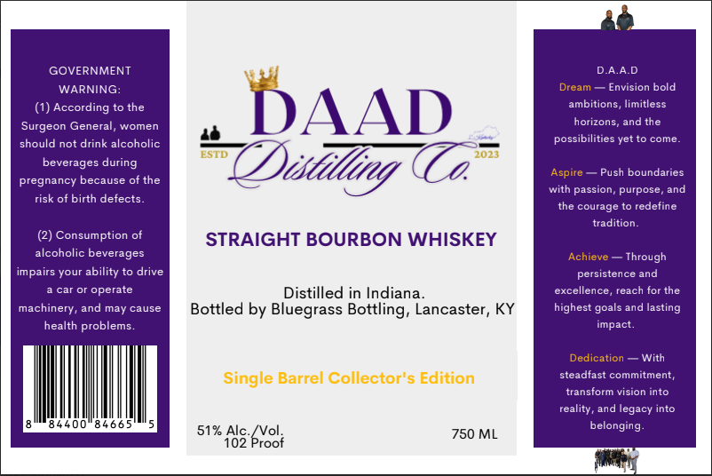

# TTB COLA Label Images - TTBID 26267001000092

**Brand Name:** DAADS

**Issue Date:** 10/01/2026

**Origin Code:** 22

**Product Class/Type:** 101

**Source:** [TTB Public COLA Registry](https://ttbonline.gov/colasonline/viewColaDetails.do?action=publicFormDisplay&ttbid=26267001000092)

## Label Images

### Label 1

## Extracted Label Text

*Text extracted via OCR - may contain errors*

**Detected Proof:** 102

### Label 1

GOVERNMENT
DAAD
WARNING:
Dream
Envision bold
(1) According to the
DAAD
ambitions, limitless
Surgeon General, women
horizons
and the
should not drink alcoholic
possibilities yet to come-
ESTD
2023
beverages during
QDistlling €
Aspire
Push boundaries
pregnancy because of the
with passion,
purpose, and
risk of birth defects_
the courage to redefine
tradition_
Consumption of
STRAIGHT BOURBON WHISKEY
alcoholic beverages
Achieve
Through
impairs your ability to drive
persistence and
car or operate
Distilled in Indiana
excellence
reach for the
machinery, and may cause
Bottled by Bluegrass Bottling, Lancaster, KY
highest
and lasting
health problems _
impact.
Dedication
With
Single Barrel Collector"s Edition
steadfast commitment;
transform vision into
reality, and legacy into
51% Alc_
belonging_
102
'Pxoof
750 ML
goals
