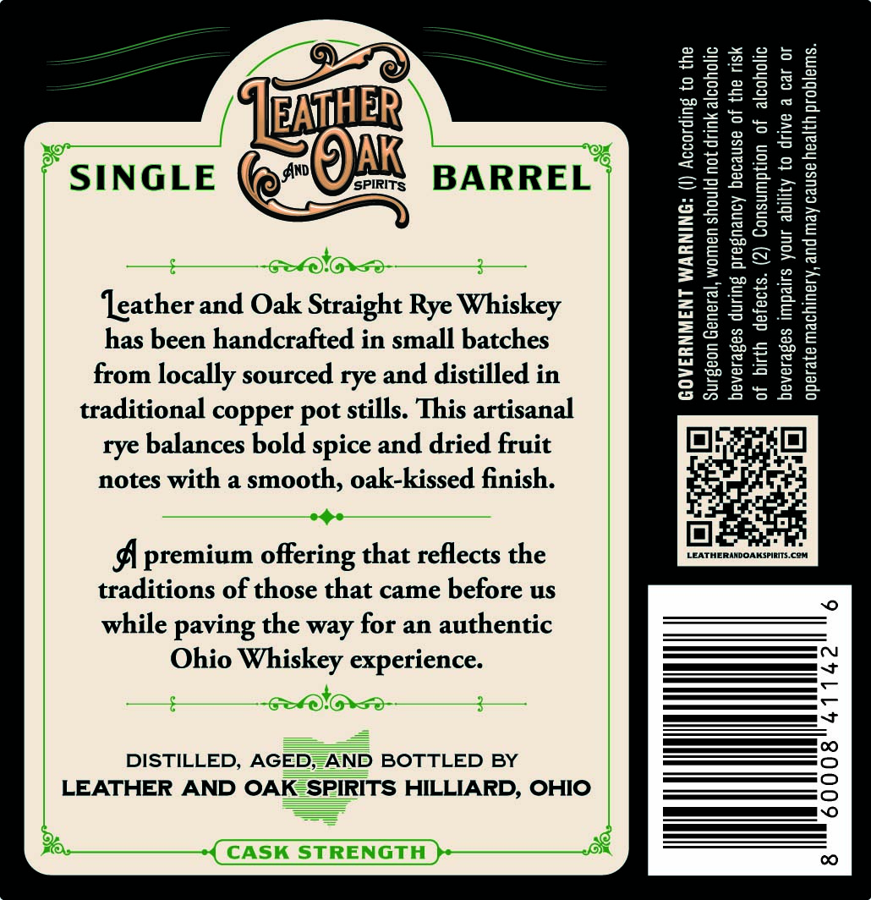
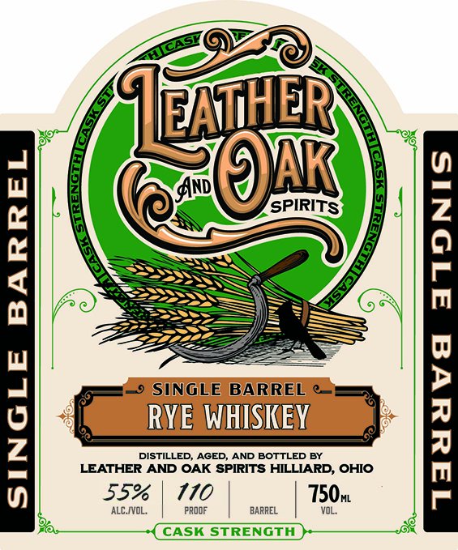

# TTB COLA Label Images - TTBID 26267001000146

**Brand Name:** LEATHER & OAK SPIRITS SINGLE BARREL RYE WHISKEY

**Issue Date:** 09/28/2026

**Origin Code:** 09

**Product Class/Type:** 142

**Source:** [TTB Public COLA Registry](https://ttbonline.gov/colasonline/viewColaDetails.do?action=publicFormDisplay&ttbid=26267001000146)

## Label Images

### Back Label

### Front Label

## Extracted Label Text

*Text extracted via OCR - may contain errors*

**Detected Proof:** 110

### Back Label

‘leather and Oak Straight Rye Whiskey
has been handcrafted in small batches
from locally sourced rye and distilled in
traditional copper pot stills. This artisanal
rye balances bold spice and dried fruit
notes with a smooth, oak-kissed finish.

A premium offering that reflects the
traditions of those that came before us
while paving the way for an authentic

Ohio Whiskey experience.

DISTILLED, AGED=AND BOTTLED BY
LEATHER AND OAK SPIRITS HILLIARD, OHIO

GOVERNMENT WARNING: (I) According to the

Surgeon General, women should not drink alcoholic

beverages during pregnancy because of the risk

of birth defects. (2) Consumption of alcoholic

beverages impairs your ability to drive a car or

ery, and may cause health problems.

### Front Label

I@hER
Anp
R
SPIRITS
1
1
SINGLE BARREL
1
DISTILLED;
RYE
AGED_
WHISKEY
AND BOTTLED BY
1
LEATHER AND OAK SPIRITS HILLIARD, OHIO
55%
110
750,
ALC IVOL;
pROOF
BARREL
Jd
CASK STRENGTH
