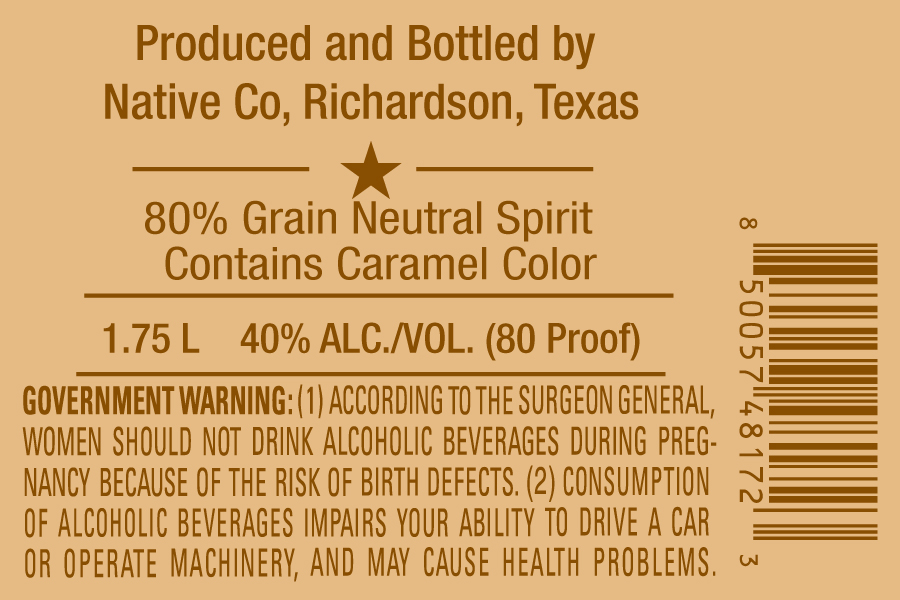
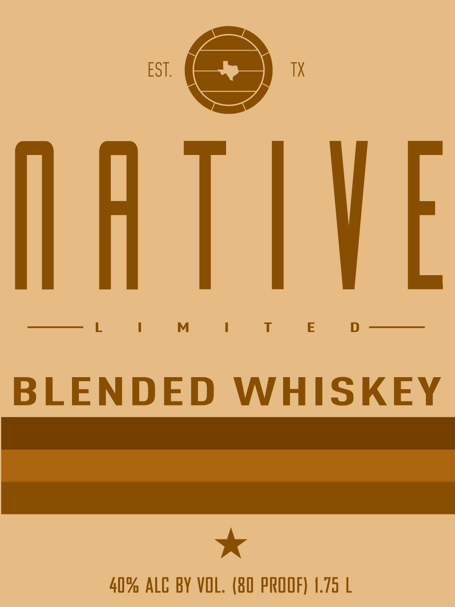

# TTB COLA Label Images - TTBID 26267001000147

**Brand Name:** NATIVE LIMITED

**Issue Date:** 09/28/2026

**Origin Code:** 44

**Product Class/Type:** 137

**Source:** [TTB Public COLA Registry](https://ttbonline.gov/colasonline/viewColaDetails.do?action=publicFormDisplay&ttbid=26267001000147)

## Label Images

### Back Label

### Front Label

## Extracted Label Text

*Text extracted via OCR - may contain errors*

**Detected Proof:** 80

### Back Label

Produced and Bottled by
Native
Richardson; Texas
80% Grain Neutral Spirit
Contains Caramel Color
1.75 L
40% ALC NOL. (80 Proof)
GOVERNMENT WARNING; (0| ACCORDING TOTHE SURGEON GENERAL;
'
WOMEN SHOULD NOT  DRINK ALCOHOLIC BEVERAGES DURING PREG:
NANCY BECAUSE OF THE RISK OF BIRTH DEFECTS, (2) CONSUMPTION
OF ALCOHOLIC BEVERAGES IMPAIRS VOUR ABILITY TO DRIVE A CAR
OR OpERATE MACHINERV; AND MAY CAuSe heAlth  PROBLEMS ,
W
Co,

### Front Label

EST
TX
IHTHE
M
T
BLENDED
WHISKEY
40% ALC BY VOL, (80 PROOF) 4.75 L
