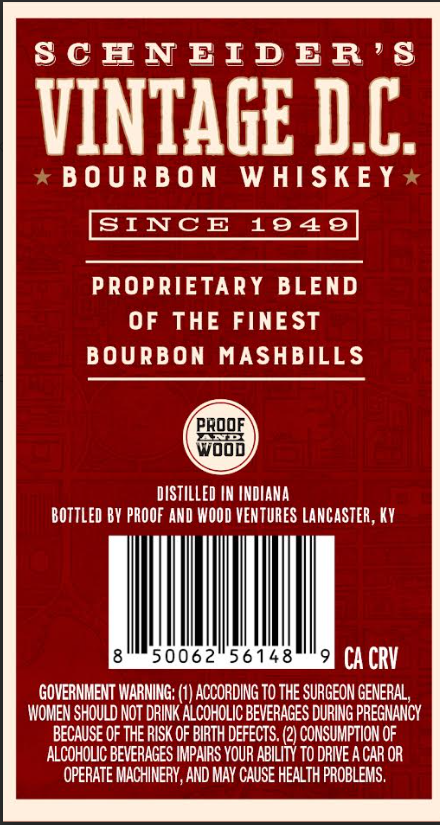
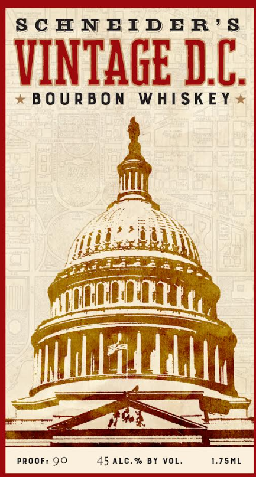

# TTB COLA Label Images - TTBID 26267001000156

**Brand Name:** SCHNEIDERS VINTAGE, DC

**Issue Date:** 10/01/2026

**Origin Code:** 22

**Product Class/Type:** 141

**Source:** [TTB Public COLA Registry](https://ttbonline.gov/colasonline/viewColaDetails.do?action=publicFormDisplay&ttbid=26267001000156)

## Label Images

### Back Label

### Front Label

## Extracted Label Text

*Text extracted via OCR - may contain errors*

*1 image(s) excluded: text did not meet readability threshold*

### Back Label

S C ENEID ER ' $
VINTAGE DC
B 0 U R B 0 N
WHISKEY *
SINCE
1949
PROPRIETARY BLEND
OF THE FINEST
BOURBON MASHBILLS
PROOF
Wood
DISTILLED IN INOIANA
BOTTLed BY PROOF AND WOOD VENTURES LANCASTEr; KY
50062
56148
CA CRV
GOVERNMENT WARNING: (1) ACCORDING TO THE SURGEON GENERAL
WOMEN SHOULD NOT DRINK ALCOHOLIC BEVERAGES DURING PREGNANCY
BECAUSE OF THE RISK OF BIRTH DEFECTS. (2) CONSUMPTION OF
ALCOHOLIC BEVERAGES IMPAIRS VOUR ABILITY TO DRIVE A CAR OR
OPERATE MACHINERY, AND MAY CAUSE HEALTH PROBLEMS .
